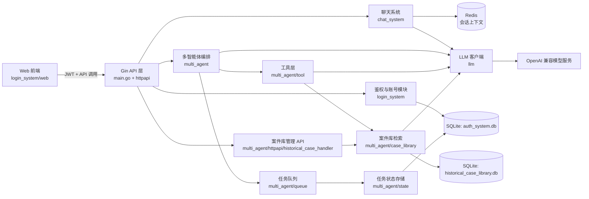
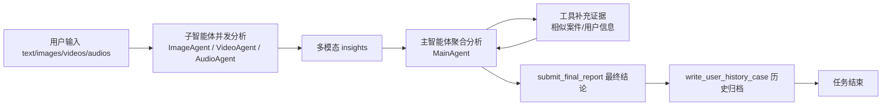

# AntiFraud AI Assistant

一个基于 Go 的反诈智能助手服务，覆盖两条主线能力：

- 登录鉴权与账号体系（验证码、注册、登录、JWT、管理员权限、限流）
- 多智能体多模态分析（文本/图像/视频/音频、异步任务、历史归档、相似案件检索）

默认服务端口：`8081`

---

## 1. 技术栈

- 语言与框架：Go `1.25`、Gin
- ORM 与数据库：GORM + SQLite
- 缓存：Redis（聊天上下文）
- 鉴权：JWT（`github.com/golang-jwt/jwt/v5`）
- 模型接口：OpenAI 兼容协议（项目内自定义 `llm` 客户端）

---

## 2. 快速启动

### 2.1 安装依赖

```bash
go mod tidy
```

### 2.2 运行服务

```bash
go run .
```

启动后可访问：

- API 基地址：`http://localhost:8081/api`
- 测试页面：`http://localhost:8081/test-login`

---

## 3. 环境变量

- `PORT`：服务端口，默认 `8081`
- `JWT_SECRET`：JWT 密钥（生产环境必须设置）
- `INVITE_CODE_ADMIN`：管理员升级邀请码（默认值仅供开发）
- `DB_PATH`：主业务库路径（默认 `DB/auth_system.db`）
- `HISTORICAL_CASE_DB_PATH`：历史案件库路径（默认 `DB/historical_case_library.db`）

---

## 4. 配置文件

主配置文件：`config/config.json`

包含配置：

- `agents.main / image / video / audio`：各智能体模型参数
- `embedding`：向量模型参数（`model`、`api_key`、`base_url`）
- `prompts.main / image / video / audio`：提示词
- `retry.max_retries`、`retry.retry_delay_ms`：统一重试策略

聊天模块单独读取：`chat_system/config/config.json`

---

## 5. 项目结构（核心目录）

- `main.go`：服务入口、路由挂载、中间件注册
- `login_system/`：注册登录、用户管理、JWT 中间件、限流
- `chat_system/`：聊天 SSE、工具调用、Redis 上下文
- `multi_agent/`：多智能体分析主流程、任务队列、工具编排、状态存储
- `multi_agent/case_library/`：历史案件库、embedding 入库、向量检索与缓存
- `llm/`：OpenAI 兼容客户端（聊天、流式、embedding）

---

## 6. 系统架构图



架构说明（摘要）：

- API 层统一接入鉴权、聊天、多模态分析、案件库管理。
- 多模态任务走“入队 -> 子智能体并发分析 -> 主智能体工具闭环 -> 归档”流程。
- 数据层双库隔离：业务库（用户/任务）与案件知识库（结构化字段 + 向量）分离。
- 聊天上下文放 Redis；模型调用统一走 `llm` 客户端，支持 Chat / Embedding / SSE。

---

## 7. 智能体交互图（多模态分析链路）

字符串式简流程：

`用户输入(text/images/videos/audios) -> 子智能体并发分析(ImageAgent/VideoAgent/AudioAgent) -> 产出各模态 insights -> 主智能体(MainAgent)聚合全部 insights + 原始文本 -> 按规则调用工具(相似案件/用户信息)补充证据 -> 主智能体给出最终结论 submit_final_report -> 写入历史 write_user_history_case -> 任务结束`



交互规则（关键约束）：

- 子智能体只负责各自模态的结构化提取，不直接写历史归档。
- 主智能体必须先 `submit_final_report`，再 `write_user_history_case`，完成后结束。
- 任务状态由 `state` 统一维护：`pending -> processing -> completed/failed`。
- 工具层负责“查询/归档动作”，模型层负责“推理与决策”。

---

## 8. 数据库设计与优化（重点）

### 8.1 多库隔离

项目使用两个独立 SQLite 文件：

- `DB/auth_system.db`：用户体系 + 多模态任务状态与归档
- `DB/historical_case_library.db`：历史案件知识库 + embedding 向量

这样做的好处：

- 权限边界清晰（业务数据与向量知识库隔离）
- 迁移和备份更灵活
- 向量检索迭代不会影响主业务库稳定性

### 8.2 主业务库（`auth_system.db`）

主要表：

- `users`
- `pending_tasks`
- `history_cases`

关键实现与优化：

- 启动自动迁移：`users` 在登录模块启动时迁移；`pending_tasks/history_cases` 在首次状态写入时迁移
- 索引策略：按 `user_id`、`status`、时间字段建立索引，覆盖常见查询路径
- 两阶段任务状态：
  - 先写 `pending_tasks`（支持处理中查询与预览）
  - 完成后迁移到 `history_cases`（历史归档）
- 事务保证：`MarkTaskCompleted`/`MarkTaskFailed` 使用事务确保“写历史 + 删 pending”原子性
- 兼容性序列化：
  - 任务中的数组字段（视频/音频/图片/insights）使用 Base64 逗号串存储
  - 读取时对历史明文做兼容回退，避免旧数据读失败
- 任务详情查询统一：`GetTaskDetailByID` 先查 pending，再查 history，前端一个接口覆盖“未完成+已完成”

### 8.3 历史案件库（`historical_case_library.db`）

核心表：`historical_case_library`

关键字段：

- 结构化字段：`title`、`target_group`、`risk_level`、`case_description`、`typical_scripts`、`keywords`、`violated_law`、`suggestion`
- 向量字段：`embedding_vector`、`embedding_model`、`embedding_dimension`

关键实现与优化：

- 独立连接单例：`sync.Once` 打开数据库并迁移，避免重复初始化
- 输入规范化与校验：
  - 人群、风险等级强枚举
  - 列表字段去空、去重
  - 必填字段统一验证并返回结构化错误
  - 案件描述质量门禁（描述过短或疑似随机字符串直接拒绝入库）
- embedding 自动化：上传案件后自动拼接结构化文本并调用 embedding 模型
- 配置化模型路由：embedding 的 `APIKey/BaseURL/Model` 从 `config/config.json` 读取
- 管理员权限隔离：上传、预览、详情、删除接口统一放在管理员路由组

### 8.4 向量检索优化（当前实现）

`search_similar_cases` 工具已经接入真实数据库检索链路：

- 查询流程：`query -> embedding -> 向量相似度排序 -> topK 返回`
- 算法细节：
  - `L2` 归一化（query 与 case 向量）
  - 清洗 `NaN/Inf`
  - 维度不一致按最短维度计算余弦相似度
  - 相似度数值夹逼到 `[-1, 1]`
- `top_k` 规格化：默认 `5`，最大 `20`
- 排序规则：相似度降序；同分按创建时间降序

### 内存驻留优化

为避免每次检索全量扫库，已实现“懒加载 + 增量刷新”：

- 首次检索时全量加载到内存缓存
- 后续检索直接读取内存快照
- 新增案件后增量 `upsert` 缓存
- 删除案件后增量 `remove` 缓存
- 冷启动并发保护：若首次加载与写入并发，使用 `pendingUpserts/pendingDeletes` 合并，避免丢更新

### 8.5 输入质量与一致性优化（新增）

- 必填字段收敛：历史案件上传仅要求 `title`、`target_group`、`risk_level`、`case_description`。
- 可选字段容错：`typical_scripts`、`keywords`、`violated_law`、`suggestion` 允许不传。
- 空值清洗策略：
  - 字符串字段统一 `TrimSpace`，空字符串视为未提供。
  - 数组字段逐项去空白、去重，仅保留有效项。
  - 可选字段若最终为空，不作为有效语义参与 embedding 拼接。
- 描述质量门禁（前后端一致）：
  - 最小长度：`12` 字符；
  - 最大长度：`400` 字符；
  - 疑似随机串/无语义文本拒绝入库。
- 前后端双重校验：
  - 前端提交前先拦截，减少无效请求；
  - 后端强校验兜底，防止绕过前端直接调用 API 写入脏数据。
- 检索工具输出统一：
  - `search_similar_cases` 中可选文本字段统一走空值兜底函数（空值返回 `none`）。
  - 描述字段不再做截断，返回原始描述（仅空值兜底），避免信息损失。

---

## 9. 智能体编排与优化（重点）

### 9.1 多智能体分工

- 子智能体：`ImageAgent`、`VideoAgent`、`AudioAgent`
- 主智能体：`MainAgent`
- 队列调度：`queue/processTask`

流程：

1. API 入队创建任务
2. 后台 goroutine 标记 `processing`
3. 子智能体并发分析各模态
4. 主智能体聚合并进入工具调用循环
5. 生成最终报告并归档历史

### 9.2 子智能体侧优化

- 通用基类 `SubAgentBase`：统一请求构造、重试、工具结果解析
- 并发处理：`AnalyzeBatchInParallel` 按输入并行，减少总时延
- 统一结构化输出：子智能体强制通过 `submit_analysis_result` 工具返回，输出格式稳定
- 模态兼容：
  - 图像 `image_url`
  - 视频 `video_url`
  - 音频 `input_audio`（附加 `modalities` 请求字段）

### 9.3 主智能体侧优化

- 工具驱动闭环：`ToolChoice = required`，强制模型通过工具写关键状态
- 上下文绑定：`user_id`、`task_id`、原始 payload、insights、final_report 全部通过 `ctx` 传递给工具
- 终态控制：仅当“最终报告已提交 + 历史归档已写入”才结束流程
- 防失控机制：最大工具轮次限制（`maxRounds=8`）
- 失败隔离：单工具失败不会导致整个轮次崩溃，错误回填到 tool message

### 9.4 重试与稳定性

- `CommonAgent.Retry` 线性退避重试
- 统一日志打点：轮次、工具调用、工具返回、最终输出长度
- 子模态失败兼容：单模态失败会产出错误文本，主流程继续执行

### 9.5 Chat 智能体侧能力

- SSE 流式输出
- 工具调用（`chat_query_user_info`、`chat_query_user_case_history`）
- Redis 会话上下文：`chat:context:<user_id>`，TTL `5` 分钟
- 会话可刷新：`POST /api/chat/refresh`

---

## 10. 安全与权限

- JWT 鉴权：校验 token 后会二次校验用户是否存在、用户名/邮箱是否匹配
- 管理员权限：
  - `GET /api/users`
  - 历史案件库上传/查询/删除接口
- 全局限流：按 IP + 时间窗口限制请求速率
- 注册安全策略：
  - 密码复杂度校验（大写+小写+符号）
  - 注册时年龄默认 `28`，不接受注册请求中直接传 `age`

---

## 11. LLM 客户端能力（`llm/`）

自定义客户端并非简单 DTO，做了协议兼容扩展：

- Chat 与 Embedding 双接口
- SSE 流式读取封装
- 多模态消息结构（文本、图像、视频、音频）
- 工具调用结构（tool calls/tool result）
- 请求扩展字段机制：`SetField` / `ExtraFields`
  - 可透传 provider 私有字段（等价于常见 SDK 的 `extra_body` 场景）

---

## 12. 核心 API（摘要）

鉴权：

- `GET /api/auth/captcha`
- `POST /api/auth/register`
- `POST /api/auth/login`
- `POST /api/upgrade`
- `GET /api/users`（admin）

多模态任务：

- `POST /api/scam/multimodal/analyze`
- `GET /api/scam/multimodal/tasks`
- `GET /api/scam/multimodal/tasks/:taskId`
- `GET /api/scam/multimodal/history`
- `DELETE /api/scam/multimodal/history/:recordId`

历史案件库（admin）：

- `POST /api/scam/case-library/cases`
- `GET /api/scam/case-library/cases`
- `GET /api/scam/case-library/options/scam-types`
- `GET /api/scam/case-library/options/target-groups`
- `GET /api/scam/case-library/cases/:caseId`
- `DELETE /api/scam/case-library/cases/:caseId`

聊天：

- `POST /api/chat`
- `GET /api/chat/context`
- `POST /api/chat/refresh`

完整接口说明见：`API.md`

数据库表结构见：`DB_SCHEMA_DEMO.md`

---

## 13. 开发与测试

推荐命令：

```bash
go test ./...
```

本地联调建议：

1. 先注册/登录拿 JWT
2. 提交多模态任务并轮询详情
3. 检查历史归档、风险等级、report 一致性
4. 使用管理员账号上传历史案件并验证相似检索结果

---

## 14. 可继续优化方向

- 向量检索可升级为 ANN 索引（当前为内存全量余弦）
- `historical_case_library` 可引入按字段加权重排
- 任务队列可引入 worker 池和持久队列（当前为进程内 goroutine）
- 增加数据库观测指标（QPS、慢查询、缓存命中率）
