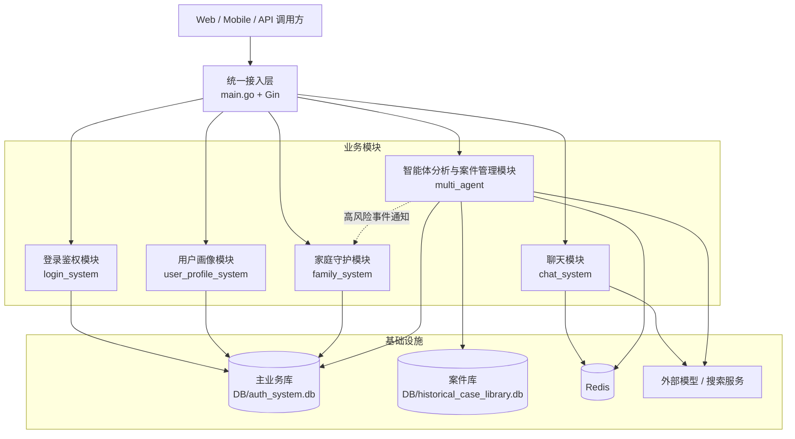
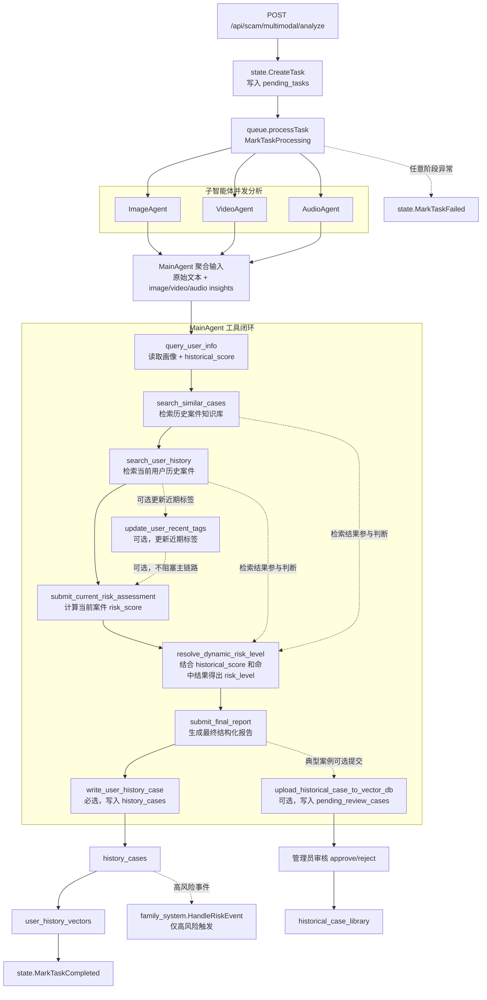

# AntiFraud AI Assistant

一个基于 Go 的反诈智能助手服务，覆盖两条主线能力：

- 登录鉴权与账号体系（验证码、注册、登录、JWT、管理员权限、限流）
- 多智能体多模态分析（文本/图像/视频/音频、异步任务、历史归档）
- 单图快速风险识别（同步返回风险等级与理由）
- **双重防护网：防诈知识库 + 个性化记忆系统**（全局相似案件检索、用户历史案件语义召回）
- 主分析流程按需自动提交案件审核（典型案例先进入待审核队列，管理员审核通过后入库知识库）
- 管理员可发起后台案件采集任务，智能体联网检索后会逐条写入待审核案件库
- 实时风险预警（WebSocket 连接下的中高风险主动推送）
- **家庭协同守护系统（MVP）**：家庭组、成员邀请、守护关系配置、家庭高风险通知

默认服务端口：`8081`

---

## 1. 技术栈

- 语言与框架：Go `1.25`、Gin
- ORM 与数据库：GORM + SQLite
- 缓存：Redis（统一缓存层：验证码、限流桶、向量库管理侧缓存、聊天上下文）
- 鉴权：JWT（`github.com/golang-jwt/jwt/v5`）
- 模型接口：OpenAI 兼容协议（项目内自定义 `llm` 客户端）

---

## 2. 快速启动

### 2.1 安装依赖

```bash
go mod tidy
```

### 2.2 运行服务

```bash
go run .
```

启动后可访问：

- API 基地址：`http://localhost:8081/api`
- 测试页面：`http://localhost:8081/test-login`

---

## 3. 环境变量

- `PORT`：服务端口，默认 `8081`
- `JWT_SECRET`：JWT 密钥（生产环境必须设置）
- `INVITE_CODE_ADMIN`：管理员升级邀请码（默认值仅供开发）
- `DB_PATH`：主业务库路径（默认 `DB/auth_system.db`）
- `HISTORICAL_CASE_DB_PATH`：历史案件库路径（默认 `DB/historical_case_library.db`）
- API Key 环境变量覆盖（高优先级，若设置则覆盖 `config/config.json`）：
  - `AGENT_MAIN_API_KEY`
  - `AGENT_IMAGE_API_KEY`
  - `AGENT_IMAGE_QUICK_API_KEY`
  - `AGENT_VIDEO_API_KEY`
  - `AGENT_AUDIO_API_KEY`
  - `AGENT_CASE_COLLECTION_API_KEY`
  - `EMBEDDING_API_KEY`
  - `CHAT_API_KEY`
  - `TAVILY_API_KEY`

---

## 4. 配置文件

主配置文件：`config/config.json`

配置职责：

- `config/config.json`：
  - `agents.main / image / image_quick / video / audio`：多智能体模型参数
  - `embedding`：向量模型参数（`model`、`api_key`、`base_url`）
  - `chat`：聊天配置（`prompt`、`model`、`api_key`、`base_url`）
  - `redis`：统一缓存配置（`addr`、`password`、`db`）
  - `alert_ws`：实时告警轮询配置（`poll_interval_seconds`、`recent_window_minutes`）
  - `family_alert_ws`：家庭通知 WebSocket 轮询配置（`poll_interval_seconds`、`recent_window_minutes`）
  - `prompts.main / image / image_quick / video / audio`：提示词
  - `retry.max_retries`、`retry.retry_delay_ms`：统一重试策略

说明：聊天模块配置已并入主配置文件（`chat_system/config/config.go` 已移除），聊天上下文存取统一走 `cache/` 模块，实际 Redis 连接由 `config/config.json` 的 `redis` 节点决定。

配置优先级说明：

- 普通运行参数仍按现有逻辑读取（如 `PORT`、`DB_PATH`、`JWT_SECRET`）。
- 上述 API Key 类字段默认读取 `config/config.json`。
- 若对应环境变量存在且非空，则环境变量优先覆盖 `config/config.json` 中的 `api_key` 配置。

### 4.1 Redis 缓存键规范（当前实现）

- `cache:captcha:<captcha_id>`：验证码缓存，TTL=`3` 分钟（一次性消费）
- `cache:rate_limit:ip:<ip>:<window_ms>`：限流计数桶，TTL=`RateLimitWindow`
- `cache:case_library:vector_records`：历史案件向量缓存（Hash）
- `cache:case_library:vector_records_ready`：向量缓存就绪标记
- `chat:context:<user_id>`：聊天会话上下文，TTL=`5` 分钟

说明：

- 家庭通知当前不走 Redis 缓存，而是“`family_notifications` 持久化 + `family_alert_ws` 最近窗口 WebSocket 推送”。

---

## 5. 项目结构（核心目录）

- `main.go`：服务入口、路由挂载、中间件注册
- `cache/`：统一 Redis 缓存函数（少参数读写、计数窗口、Hash 管理）
- `database/`：数据库连接、统一 schema 初始化入口（`InitPersistence`）
- `login_system/auth/`：JWT 能力边界（claims、签发、验签、鉴权错误语义）
- `login_system/`：注册登录、用户管理、JWT 中间件、限流
- `user_profile_system/`：用户画像扩展字段（职业、近期标签）、职业配置与资料更新接口
- `family_system/`：家庭组、成员关系、邀请、守护关系、家庭通知
- `chat_system/`：聊天 SSE、工具调用、Redis 上下文
- `multi_agent/`：多智能体分析主流程、任务队列、工具编排、状态存储
- `multi_agent/overview/`：用户风险总览聚合（基于历史案件生成趋势与统计）
- `multi_agent/case_library/`：历史案件库、embedding 入库、向量检索与缓存
- `llm/`：OpenAI 兼容客户端（聊天、流式、embedding）

---

## 6. 系统架构图



架构说明（摘要）：

- 第 6 节只保留系统模块边界，不展开智能体内部分析过程；完整分析链路见下一节“智能体交互图”。
- `main.go` 统一挂载公开认证接口、受保护业务接口和静态页面入口，再把请求分发到登录、画像、家庭、聊天和智能体分析模块。
- 数据层保持双库隔离：主业务库承载用户、家庭、任务和历史归档；案件库承载历史案件知识库与待审核案件。
- Redis 统一承担验证码、限流、聊天上下文和案件向量缓存；聊天模块与智能体模块都会访问外部模型或搜索服务。
- 家庭系统与智能体主链路保持解耦，只在“高风险历史事件”产生后接收通知回调。

---

## 7. 智能体交互图（多模态分析链路）

字符串式简流程：

`POST /api/scam/multimodal/analyze -> state.CreateTask(pending) -> queue.processTask -> MarkTaskProcessing -> ImageAgent/VideoAgent/AudioAgent 并发产出 insights -> MainAgent 聚合文本与多模态证据 -> 工具循环(query_user_info / search_similar_cases / search_user_history / update_user_recent_tags[可选] / submit_current_risk_assessment / resolve_dynamic_risk_level / submit_final_report / upload_historical_case_to_vector_db[可选] / write_user_history_case) -> history_cases -> user_history_vectors -> 高风险事件回调 family_system -> state.MarkTaskCompleted`



交互规则（关键约束）：

- 子智能体只做模态级结构化提取，不直接落库、不直接写最终报告。
- 主智能体先聚合原始文本和多模态 `insights`，再进入工具循环；知识库检索和用户历史检索负责补充证据，不负责直接给最终结论。
- `submit_current_risk_assessment` 是当前案件评分入口；`resolve_dynamic_risk_level` 依赖 `query_user_info` 提供的 `historical_score`，并结合知识库/用户历史命中结果推导最终风险等级。
- `submit_final_report` 用于生成最终结构化报告；若案件具备典型性，可额外调用 `upload_historical_case_to_vector_db` 把案件送入 `pending_review_cases`，等待管理员审核后再进入正式知识库。
- `write_user_history_case` 是任务终态必选步骤：它会把案件写入 `history_cases`，并进一步写入 `user_history_vectors` 语义索引；高风险历史记录随后会触发家庭系统通知回调。
- 任务状态由 `state` 统一维护，状态流转为 `pending -> processing -> completed/failed`。

---

## 8. 数据库设计与优化（重点）

### 8.1 多库隔离

项目使用两个独立 SQLite 文件：

- `DB/auth_system.db`：用户体系 + 多模态任务状态与归档
- `DB/historical_case_library.db`：历史案件知识库 + embedding 向量

这样做的好处：

- 权限边界清晰（业务数据与向量知识库隔离）
- 迁移和备份更灵活
- 向量检索迭代不会影响主业务库稳定性

### 8.2 主业务库（`auth_system.db`）

主要表：

- `users`
- `family_groups`
- `family_members`
- `family_invitations`
- `family_guardian_links`
- `family_notifications`
- `pending_tasks`
- `history_cases`
- `user_history_vectors`

关键实现与优化：

- 启动自动迁移：`users` 在登录模块启动时迁移；`pending_tasks/history_cases` 在首次状态写入时迁移
- 索引策略：按 `user_id`、`status`、时间字段建立索引，覆盖常见查询路径
- 两阶段任务状态：
  - 先写 `pending_tasks`（支持处理中查询与预览）
  - 完成后迁移到 `history_cases`（历史归档）
- 事务保证：`MarkTaskCompleted`/`MarkTaskFailed` 使用事务确保“写历史 + 删 pending”原子性
- 兼容性序列化：
  - 任务中的数组字段（视频/音频/图片/insights）使用 Base64 逗号串存储
  - 读取时对历史明文做兼容回退，避免旧数据读失败
- 任务详情查询统一：`GetTaskDetailByID` 先查 pending，再查 history，前端一个接口覆盖“未完成+已完成”
- 家庭系统解耦建模：
  - `family_groups`：家庭组本体
  - `family_members`：家庭成员与角色
  - `family_invitations`：家庭邀请暂存记录（用户加入或邀请过期后清理）
  - `family_guardian_links`：守护人 -> 被守护成员配置
  - `family_notifications`：面向守护人的家庭风险通知
- 风险事件联动：
  - `write_user_history_case` 最终归档后触发历史事件回调
  - 家庭系统只订阅“高风险历史归档事件”
  - 守护关系命中后再生成家庭通知，避免主分析链路被家庭模块反向耦合
- 用户历史语义索引拆表：
  - `history_cases` 保存业务归档事实
  - `user_history_vectors` 保存用户历史案件的语义索引
  - 索引表当前只保留 `record_id`、`user_id`、`embedding_vector`、`embedding_model`、`embedding_dimension` 与时间字段，避免和业务详情重复耦合

### 8.2.1 家庭系统（MVP）设计与实现

核心目标：

- 把反诈从“个人自救”扩展到“家庭联防”
- 当被守护成员出现高风险案件时，让守护人收到家庭通知
- 保持低耦合：家庭系统不直接改写多模态分析、聊天、登录主流程

当前实现边界：

- 每个用户在 MVP 阶段默认只加入一个家庭
- 家庭创建者为 `owner`
- 家庭成员角色支持：`owner`、`guardian`、`member`
- 邀请支持按邮箱或手机号定向
- 守护关系通过 `family_guardian_links` 独立配置
- 高风险家庭通知通过 `family_notifications` 持久化，并通过家庭通知 WebSocket 按 `family_alert_ws` 配置的最近窗口主动推送给守护人

当前已落地的家庭接口：

- `POST /api/families`
- `GET /api/families/me`
- `POST /api/families/invitations`
- `GET /api/families/invitations`
- `POST /api/families/invitations/accept`
- `GET /api/families/members`
- `PATCH /api/families/members/:memberId`
- `DELETE /api/families/members/:memberId`
- `POST /api/families/guardian-links`
- `GET /api/families/guardian-links`
- `DELETE /api/families/guardian-links/:linkId`
- `GET /api/families/notifications/ws`
- `POST /api/families/notifications/:notificationId/read`

#### 用户历史向量化（当前实现）

- `write_user_history_case` 成功归档后，会额外为当前用户历史记录生成 embedding 并写入 `user_history_vectors`
- 当前真正参与**用户历史向量化**的字段只有 3 个：
  - `title`
  - `case_summary`
  - `scam_type`
- 为避免噪声和旧业务改动扩散，以下字段**当前不进入**用户历史 embedding 文本：
  - `risk_level`
  - `report`
  - 原始多模态输入（`payload_text/videos/audios/images`）
  - 多模态洞察（`video/audio/image insights`）
- 当前用户历史检索工具的语义召回链路为：
  - `query -> embedding -> user_history_vectors 召回 topK`
  - 工具层再按现有历史展示格式组装返回结果

### 8.3 历史案件库（`historical_case_library.db`）

核心表：`historical_case_library`、`pending_review_cases`

关键字段：

- 结构化字段：`title`、`target_group`、`risk_level`、`case_description`、`typical_scripts`、`keywords`、`violated_law`、`suggestion`
- 向量字段：`embedding_vector`、`embedding_model`、`embedding_dimension`

关键实现与优化：

- 独立连接单例：`sync.Once` 打开数据库并迁移，避免重复初始化
- 输入规范化与校验：
  - 人群、风险等级强枚举
  - 列表字段去空、去重
  - 必填字段统一验证并返回结构化错误
  - 案件描述质量门禁（描述过短或疑似随机字符串直接拒绝入库）
- embedding 自动化：上传案件后统一通过 `BuildEmbeddingInput` 构造 embedding 文本并调用 embedding 模型
- 当前真正参与向量化的字段只有 4 类：
  - `title`
  - `scam_type`
  - `case_description`
  - 高质量 `keywords`
- 为避免语义噪声，以下字段当前不进入 embedding 文本：
  - `target_group`
  - `risk_level`
  - `typical_scripts`
  - `violated_law`
  - `suggestion`
- `keywords` 不是无条件进入向量：
  - 会先做去空、去重与长度/字符质量过滤
  - 只有关键词整体质量足够时才会拼入 embedding 文本
- 配置化模型路由：embedding 的 `APIKey/BaseURL/Model` 从 `config/config.json` 读取
- 管理员权限隔离：上传、预览、详情、删除接口统一放在管理员路由组

### 8.4 向量检索与缓存优化（当前实现）

`search_similar_cases` 工具已经接入真实数据库检索链路：

- 查询流程：`query -> embedding -> Redis 快照读取(缺失时回源 DB) -> 向量相似度排序 -> topK 返回`
- 检索实现已解耦为“向量召回核心 + 过滤/排序 helper”，避免聊天系统与多智能体系统各自维护一套相似度逻辑
- 原始无条件接口仍保留；新增过滤版接口支持：
  - `target_group` 精确过滤后再做向量召回
  - `scam_type` 精确过滤后再做向量召回
  - 两个条件都为空时，行为与原始检索函数完全一致
- 算法细节：
  - `L2` 归一化（query 与 case 向量）
  - 清洗 `NaN/Inf`
  - 维度不一致按最短维度计算余弦相似度
  - 相似度数值夹逼到 `[-1, 1]`
- `top_k` 规格化：默认 `5`，最大 `20`
- 排序规则：相似度降序；同分按创建时间降序
- 检索阶段的工程优化：
  - 查询向量无效时直接返回明确错误，避免后续空跑
  - 个别案件向量无效时跳过该记录，不影响整体召回
  - 结果格式统一为 `SimilarCaseResult`，上层工具只负责格式化展示，不重复实现排序/过滤

### 分布式缓存优化（新增）

向量库缓存已由进程内内存迁移到 Redis，当前策略：

- 服务启动时尝试预热 `cache:case_library:vector_records`，详情读取与向量检索共用同一份 Redis 快照
- 首次检索时若缓存未就绪，回源 DB 并回填 Redis Hash
- 后续检索直接读取 Redis 快照
- 新增案件后增量 `HSET` 同步缓存
- 删除案件后增量 `HDEL` 同步缓存
- Redis 异常时查询自动回源 DB，避免级联故障
- 缓存记录统一走克隆副本，避免调用方误修改共享快照数据

### 8.5 输入质量与一致性优化（新增）

- 必填字段收敛：历史案件上传仅要求 `title`、`target_group`、`risk_level`、`case_description`。
- 可选字段容错：`typical_scripts`、`keywords`、`violated_law`、`suggestion` 允许不传。
- 空值清洗策略：
  - 字符串字段统一 `TrimSpace`，空字符串视为未提供。
  - 数组字段逐项去空白、去重，仅保留有效项。
  - 可选字段若最终为空，不作为有效语义参与 embedding 拼接。
- 描述质量门禁（前后端一致）：
  - 最小长度：`12` 字符；
  - 最大长度：`400` 字符；
  - 疑似随机串/无语义文本拒绝入库。
- 前后端双重校验：
  - 前端提交前先拦截，减少无效请求；
  - 后端强校验兜底，防止绕过前端直接调用 API 写入脏数据。
- 检索工具输出统一：
  - `search_similar_cases` 中可选文本字段统一走空值兜底函数（空值返回 `none`）。
  - 描述字段不再做截断，返回原始描述（仅空值兜底），避免信息损失。

---

## 9. 智能体编排与优化（重点）

### 9.1 多智能体分工

- 子智能体：`ImageAgent`、`VideoAgent`、`AudioAgent`
- 主智能体：`MainAgent`
- 队列调度：`queue/processTask`（当前为进程内异步执行）

流程：

1. API 入队创建任务
2. 后台异步执行并标记 `processing`
3. 子智能体并发分析各模态
4. 主智能体聚合并进入工具调用循环
5. 生成最终报告并归档历史

### 9.2 子智能体侧优化

- 通用基类 `SubAgentBase`：统一请求构造、重试、工具结果解析
- 并发处理：`AnalyzeBatchInParallel` 按输入并行，减少总时延
- 统一结构化输出：子智能体强制通过 `submit_analysis_result` 工具返回，输出格式稳定
- 独立快速识别链路：`ImageQuickAgent` 读取 `agents.image_quick` / `prompts.image_quick`，同步返回 `risk_level` 与 `reason`，不进入任务队列、不写历史归档
- 模态兼容：
  - 图像 `image_url`
  - 视频 `video_url`
  - 音频 `input_audio`（附加 `modalities` 请求字段）

### 9.3 主智能体侧优化

- 工具驱动闭环：`ToolChoice = required`，强制模型通过工具写关键状态
- 上下文绑定：`user_id`、`task_id`、原始 payload、insights、final_report 全部通过 `ctx` 传递给工具
- 终态控制：仅当“最终报告已提交 + 历史归档已写入”才结束流程
- 防失控机制：最大工具轮次限制（`maxRounds=8`）
- 失败隔离：单工具失败不会导致整个轮次崩溃，错误回填到 tool message

### 9.4 重试与稳定性

- `CommonAgent.Retry` 线性退避重试
- 统一日志打点：轮次、工具调用、工具返回、最终输出长度
- 子模态失败兼容：单模态失败会产出错误文本，主流程继续执行

### 9.5 Chat 智能体侧能力

- SSE 流式输出
- 基于 Responses API 的工具调用闭环：支持 `function_call` / `function_call_output` 续接，系统提示词按 `developer` 角色注入
- 多模态交互：聊天接口除文本外还支持可选多图输入，前端将图片编码为 Base64 Data URL，后端按 Responses API 的 `input_text` + `input_image` 格式转发
- 联网能力：内置 `web_search` 工具，可在聊天轮次中触发联网检索；`web_search_call` 不写回下一轮上下文，避免污染会话历史
- **双重召回能力**：
  - **防诈知识库**：通过 `search_similar_cases` 访问全局历史案件库，支持向量召回，并可按 `target_group` / `scam_type` 过滤。
  - **个性化记忆系统**：通过 `search_user_history` 基于语义召回该用户过往遇到的相似骗局，实现跨时空关联。
- 用户信息深度交互：
  - `chat_query_user_info`：查询当前登录用户画像、职业、近期标签、账号状态、历史风险概览
  - `update_user_recent_tags`：更新当前用户近期标签，沉淀近期状态画像
  - `chat_query_user_case_history`：查询当前用户历史案件记录与数量
- 系统内信息深度交互：
  - 聊天系统会结合 Redis 会话上下文、知识库和记忆系统、工具返回结果做多轮推理。
- Redis 会话上下文：`chat:context:<user_id>`，TTL `5` 分钟（通过 `cache/` 统一函数读写）
- 会话可刷新：`POST /api/chat/refresh`

### 9.6 用户风险趋势总览（创新点）

- 新增用户风险总览聚合层：`multi_agent/overview/`，直接复用历史案件数据（`GetCaseHistory`）生成轻量总览。
- 面向“运营看盘 + 用户自查”场景，输出两类核心信息：
  - 风险变化趋势：按时间桶聚合（`day/week/month`）统计每个时间段的 `high/medium/low/total`。
  - 风险等级统计：返回用户历史总体 `high/medium/low/total` 数量，便于快速判断风险结构。
- 在统计结果之上，新增轻量中文趋势分析：
  - `overall_trend`：最近两个活跃窗口的整体风险变化（比较 `total`）
  - `high_risk_trend`：最近两个活跃窗口的高风险变化（比较 `high`）
  - `summary`：直接面向用户展示的中文总结语
- 当前窗口规则：
  - `day`：最近 `7` 天 vs 上一个 `7` 天
  - `week`：最近 `2` 周 vs 上一个 `2` 周
  - `month`：最近 `1` 个月 vs 上一个 `1` 个月
- `trend[].time_bucket` 仍然是单个时间桶；
- `analysis.current_bucket` / `analysis.previous_bucket` 则是窗口标签，格式为 `<start_bucket> ~ <end_bucket>`，其中每个桶沿用对应 `time_bucket` 的格式规则。
- 若最近窗口内没有案件，则直接返回 `近期无案件`，不继续做趋势升降判断。
- 接口：`GET /api/scam/multimodal/history/overview?interval=day|week|month`
- 设计目标：与案件明细查询解耦，总览接口可独立扩展为报表、看板、告警订阅等上层业务能力。

### 9.7 历史案件库运营统计总览（创新点）

- 在 `multi_agent/httpapi/historical_case_statistics_*` 中新增管理员统计聚合能力，直接使用历史案件预览接口数据（`ListHistoricalCasePreviews`）做轻量聚合。
- 面向“案件库运营/知识库治理”场景，返回多维度统计：
  - 按诈骗类型统计：`by_scam_type`
  - 按目标人群统计：`by_target_group`
  - 按时间粒度趋势：`trend`（支持 `day/week/month`）
- 接口：`GET /api/scam/case-library/cases/overview?interval=day|week|month`
- 权限要求：仅管理员可访问（挂载在 `AdminMiddleware` 路由组下）。

### 9.7.1 案件知识图谱画像（V1）

- 新增管理员接口：`GET /api/scam/case-library/cases/graph`
- V1 坚持只读分析，不改数据库结构，直接复用 `historical_case_library` 现有字段生成诈骗类型画像与轻量图谱。
- 当前已接入 Redis 结果缓存：按 `focus_type + focus_group + top_k` 缓存图谱分析结果，默认缓存 `5` 分钟；缓存不可用时自动回退为现算。
- 当前输出包括：
  - `profiles`：每个诈骗类型的案例数、风险分布、高频目标人群、高频关键词、相似类型
  - `graph.nodes / graph.edges`：类型、人群、关键词节点及其关联边
  - `target_group_top_scam_types`：每类目标人群下按案件数量排序的诈骗类型 TopK，`score` 为该类型在该人群总案件中的占比
- `target_group_top_scam_types` 由同一份诈骗类型聚合结果二次派生，不会为这组数据额外重复扫描数据库。
- 管理员前端默认请求不带 `focus_group`；点击指定目标人群后，再按该人群请求 `target_group_top_scam_types` 并渲染横向柱状图。
- 当前相似分数由三部分加权：
  - 向量中心余弦相似度 `0.6`
  - 关键词重合度 `0.25`
  - 目标人群重合度 `0.15`
- 管理员前端“全景分析”页已接入 V1 交互式图谱：
  - **可视化技术**：采用 `vis-network` 高性能 Canvas 渲染，支持万级关系网络流畅交互。
  - **圆润风格 UI**：采用现代化的圆润节点设计，配合柔和配色、扩散性阴影和平滑曲线连线。
  - **人群视角锚点 (Target Hubs)**：将“目标人群”节点设为菱形大锚点，作为图谱的拓扑中心。
  - **视角切换交互**：支持点击人群锚点自动高亮关联的所有诈骗手法，实现“计算在类型，观察在人群”的混合分析逻辑。
  - **独立交互空间**：图谱以全屏模态框形式展现，避免滚轮缩放操作干扰主页面滚动。

### 9.8 实时风险预警推送（WebSocket）

- 新增接口：`GET /api/alert/ws`
- 触发规则：连接建立后按 `config/config.json -> alert_ws` 配置轮询用户 `history_cases`，命中“中/高风险且在告警窗口内”记录时主动推送。
- 推送消息类型：`risk_alert`，包含 `record_id/title/case_summary/scam_type/risk_level/created_at/sent_at`。
- 连接中断后服务端轮询协程自动退出，前端负责重连策略（建议指数退避）。
- 浏览器接入方式：`ws(s)://<host>/api/alert/ws?token=<JWT_TOKEN>`（原生 WebSocket 无法自定义 Authorization 头）。
- 默认值（配置缺失或非法时回退）：`poll_interval_seconds=30`、`recent_window_minutes=60`。

### 9.9 主流程按需自动提交案件审核（更新）

- 主智能体工具链：`upload_historical_case_to_vector_db`（案件提交至待审核队列）。
- 行为变更：工具不再直接调用 `CreateHistoricalCase` 入库，而是写入 `pending_review_cases` 表。
- 待审核写入前会先生成 embedding，并与真实案件库做 top1 向量比对；若相似度 `>= 0.9`，则视为重复案件并直接拒绝写入待审核表。
- 管理员审核通过后，系统调用 `CreateHistoricalCase` 完成 embedding 生成并写入 `historical_case_library` 知识库，随后从 `pending_review_cases` 物理删除该待审核记录。
- 触发原则：当案件被判定为”典型案例”时可提交审核，风险等级不设门槛（高/中/低均可）。
- 跳过原则：若案件不具备典型性，或证据不足、字段不完整，则不执行提交。
- 调用顺序约束：
  - `submit_final_report`
  - （可选）`upload_historical_case_to_vector_db`
  - `write_user_history_case`（必需终态步骤）
- 管理员审核接口：
  - `GET /api/scam/review/cases`：待审核列表
  - `GET /api/scam/review/cases/:recordId`：待审核详情
  - `POST /api/scam/review/cases/:recordId/approve`：审核通过入库
- 管理员后台案件采集接口：
  - `POST /api/scam/case-collection/search`：后台启动案件采集，按主题联网检索并逐条写入待审核案件库
- 设计目标：在不强制每案入库的前提下，增加人工审核环节，确保知识库质量可控。

---

## 10. 安全与权限

- JWT 鉴权：校验 token 后会二次校验用户是否存在、用户名/邮箱是否匹配
- 活跃会话限制：基于 Redis 维护单用户最近活跃 token 队列，最多保留 `2` 个活跃 token，活跃 TTL 为 `5` 分钟；超出上限时按队列语义挤掉最旧 token
- 鉴权中间件解耦：`AuthMiddleware/AdminMiddleware` 通过 `AuthUserReader` 接口注入用户读取能力，不再直接依赖全局 `database.DB`
- 管理员权限：
  - `GET /api/users`
  - 历史案件库上传/查询/删除接口
  - 案件审核列表/详情/通过接口
  - 后台案件采集启动接口
- 全局限流：按 IP + 时间窗口限制请求速率（计数存储于 Redis）
- 注册安全策略：
  - 密码复杂度校验（大写+小写+符号）
  - 注册时年龄默认 `28`，不接受注册请求中直接传 `age`

中间件注入示例（`main.go`）：

```go
authUserReader := middleware.NewGormAuthUserReader(database.DB)
api.Use(middleware.AuthMiddleware(authUserReader))
api.GET("/users", middleware.AdminMiddleware(authUserReader), controllers.GetAllUsersHandle)
```

---

## 11. LLM 客户端能力（`llm/`）

自定义客户端并非简单 DTO，做了协议兼容扩展：

- Chat 与 Embedding 双接口
- SSE 流式读取封装
- 多模态消息结构（文本、图像、视频、音频）
- 工具调用结构（tool calls/tool result）
- 请求扩展字段机制：`SetField` / `ExtraFields`
  - 可透传 provider 私有字段（等价于常见 SDK 的 `extra_body` 场景）

---

## 12. 核心 API（摘要）

鉴权：

- `GET /api/auth/captcha`
- `POST /api/auth/register`
- `POST /api/auth/login`
- `POST /api/upgrade`
- `GET /api/users`（admin）

多模态任务：

- `POST /api/scam/image/quick-analyze`
- `POST /api/scam/multimodal/analyze`
- `GET /api/scam/multimodal/tasks`
- `GET /api/scam/multimodal/tasks/:taskId`
- `GET /api/scam/multimodal/history`
- `GET /api/scam/multimodal/history/overview`
- `DELETE /api/scam/multimodal/history/:recordId`

实时告警：

- `GET /api/alert/ws`（WebSocket）

历史案件库（admin）：

- `POST /api/scam/case-library/cases`
- `GET /api/scam/case-library/cases`
- `GET /api/scam/case-library/options/scam-types`
- `GET /api/scam/case-library/options/target-groups`
- `GET /api/scam/case-library/cases/:caseId`
- `DELETE /api/scam/case-library/cases/:caseId`

案件审核（admin）：

- `GET /api/scam/review/cases`
- `GET /api/scam/review/cases/:recordId`
- `POST /api/scam/review/cases/:recordId/approve`

后台案件采集（admin）：

- `POST /api/scam/case-collection/search`

聊天：

- `POST /api/chat`：支持文本，或文本 + 多张图片（`images` 传 Base64 Data URL 数组）
- `GET /api/chat/context`
- `POST /api/chat/refresh`

完整接口说明见：`API.md`

数据库表结构见：`DB_SCHEMA_DEMO.md`

---

## 13. 开发与测试

推荐命令：

```bash
go test ./...
```

启动前检查（建议）：

1. 确认 Redis 可用，并与 `config/config.json -> redis` 一致。
2. 确认数据库文件目录可写（`DB_PATH`、`HISTORICAL_CASE_DB_PATH`）。
3. 生产环境必须设置 `JWT_SECRET` 与 `INVITE_CODE_ADMIN`。

本地联调建议：

1. 先注册/登录拿 JWT
2. 调用 `/api/scam/image/quick-analyze` 验证单图快速风险识别同步返回
3. 建立 `/api/alert/ws` WebSocket 连接并观察连接状态
4. 提交多模态任务并轮询详情
5. 检查历史归档、风险等级、report 与实时告警一致性
6. 使用管理员账号上传历史案件并验证相似检索结果
7. 提交多模态分析后，检查 `pending_review_cases` 表有新记录；管理员审核通过后检查 `historical_case_library` 表有新增
8. 使用管理员账号调用 `/api/scam/case-collection/search`，确认后台采集任务会逐条把案件写入 `pending_review_cases`

---

## 14. 可继续优化方向

- 向量检索可升级为 ANN 索引（当前为 Redis 快照 + 全量余弦）
- `historical_case_library` 可引入按字段加权重排
- 任务队列可引入 worker 池和持久队列（当前为进程内 goroutine）
- 增加数据库观测指标（QPS、慢查询、缓存命中率）

---

## 15. 工程优化进展（2026-03）

### 15.1 已完成优化

- **后端流式查询优化（OOM 风险治理）**：
  - 针对图谱构建和统计总览，引入 `StreamAllHistoricalCases` 和 `StreamHistoricalCasePreviews` 流式接口。
  - 避免将全量原始案件记录整体加载进大切片；内存模型从“全量原始记录 + 聚合态”收敛为“流式读取 + 必要聚合态”。
  - 在不改变当前画像统计与类型相似度能力的前提下，已属于较低内存占用方案，显著降低峰值内存与 OOM 风险；但这里不把当前实现表述为严格数学意义上的 `O(1)`。
  - 采用 **Streaming Aggregation（流式聚合）** 模式，数据边读取边计算；其中统计总览主要保留计数器状态，图谱分析额外保留类型聚合信息与相似度计算所需向量数据。
- 新增统一缓存模块 `cache/`，减少业务侧重复缓存代码。
- 验证码从进程内 `map` 迁移到 Redis，支持多实例一致校验与一次性消费。
- 限流桶从进程内 `map` 迁移到 Redis 计数窗口，支持多实例共享限流配额。
- 向量库管理侧缓存迁移到 Redis Hash，支持多实例共享检索快照。
- 聊天上下文读写迁移到 `cache/` 通用函数，缓存访问路径统一。
- 主配置新增 `redis` 节点，统一缓存连接参数收敛在 `config/config.json`。
- Auth 边界解耦：JWT 逻辑收敛到 `login_system/auth`，`Auth/Admin` 中间件通过接口注入读取用户数据，去除对控制器与全局 DB 的直接耦合。

### 15.2 当前边界

- 多模态任务队列仍是进程内异步执行模型（`go processTask`），还不是分布式 Worker 架构。

### 15.3 下一阶段建议（低改动优先）

- 先引入 DB 抢占式 Worker（`ClaimNextTask`），将任务消费从“本地 goroutine”升级为“多实例共享任务池”。
- 再补充任务租约心跳（`lease_until`）与重试上限（`retry_count`），降低长任务与异常任务引发的级联风险。
