# 《反诈卫士（Sensible AI）》用户操作说明书

文档版本：V1.0  
文档类型：用户操作说明书  

## 1. 文档说明

### 1.1 编写目的

本说明书用于指导用户快速理解并使用《反诈卫士（Sensible AI）》。

文档重点回答以下问题：

1. 这个系统能做什么。
2. 第一次打开后应该先做什么。
3. 遇到可疑信息时该从哪里进入分析。
4. 分析完成后应该怎么看结果。
5. 如果希望持续守护，应该如何开启权限与提醒。
6. 如果要和家人联动，应该如何配置家庭关系。
7. 如果遇到无法操作、看不懂结果、没有收到提醒等情况，应该如何排查。

### 1.2 适用范围

本说明书适用于以下使用场景：

1. 普通用户首次安装并使用本系统。
2. 用户进行文本、图片、音频、视频等可疑内容分析。
3. 用户使用 AI 助手进行咨询和追问。
4. 用户查看风险历史、趋势变化和地区风险信息。
5. 用户开启悬浮窗、通知、后台守护、无障碍守护等持续防护能力。
6. 用户创建家庭、邀请成员、设置守护关系、接收家庭联防通知。
7. 用户参与 AI 反诈模拟训练。

### 1.3 阅读建议

如果您是第一次使用，建议按以下顺序阅读：

1. 先看“安装与首次启动”。
2. 再看“首页与导航说明”。
3. 然后看“核心功能操作说明”。
4. 最后看“常见问题”和“注意事项”。

如果您已经安装完成，只需要了解某项功能，可以直接跳转到对应章节。

### 1.4 文档写法说明

为方便普通用户理解，本文档统一采用以下表达方式：

1. 用“进入哪里”说明入口位置。
2. 用“点击什么”说明操作动作。
3. 用“会出现什么”说明界面反馈。
4. 用“建议怎么做”说明下一步动作。
5. 用“可能原因”说明异常情况。

---

## 2. 软件简介

### 2.1 软件名称

软件名称为《反诈卫士（Sensible AI）》。

### 2.2 软件定位

本软件是一套面向普通公众的智能反诈系统，提供核心防护与辅助判断能力：

1. 帮助识别可疑内容。
2. 在确认前提供辅助判断。
3. 保存历史记录用于长期复盘。
4. 高风险场景下主动提醒。
5. 在需要时通知家庭守护人。
6. 通过模拟训练提升防骗意识。

### 2.3 主要功能概览

本软件当前主要包含以下功能：

1. 登录与注册。
2. 文本风险分析。
3. 图片风险分析。
4. 音频风险分析。
5. 视频风险分析。
6. 深度综合分析。
7. AI 助手聊天咨询。
8. 风险历史查看。
9. 风险趋势查看。
10. 地区风险信息查看。
11. 主动提醒与后台守护。
12. 悬浮窗快捷识别。
13. 无障碍自动守护。
14. 家庭中心。
15. 家庭联防通知。
16. AI 反诈模拟训练。
17. 个人资料与隐私相关设置。

### 2.4 典型使用场景

以下情况都适合使用本软件：

1. 聊天中对方让您转账。
2. 对方索要短信验证码。
3. 对方要求您下载某个陌生应用。
4. 对方发来客服退款截图。
5. 对方发来“安全账户”页面。
6. 您收到陌生语音或通话录音。
7. 您刷到可疑视频或短链接。
8. 家中老人收到疑似诈骗信息，需要家人协助判断。
9. 您想回看最近一段时间遇到过的风险事件。
10. 您想系统练习识别诈骗套路。

### 2.5 使用价值

本软件的核心价值为：

1. 降低紧张场景下的判断压力，将复杂风险转化为易读结论。
2. 将个人防护扩展为长期的历史记忆与家庭协同防护机制。
3. 实现从事后补救到事中提醒与事前训练的防范前移。

---

## 3. 运行环境与使用前提

### 3.1 运行环境

建议在以下环境中使用本软件：

1. Android 移动设备。
2. 网络连接稳定。
3. 设备可正常接收通知。
4. 设备允许应用在后台保持基本运行。

### 3.2 建议准备内容

首次使用前，建议您准备以下内容：

1. 可正常使用的手机号。
2. 可正常接收验证码的设备。
3. 稳定网络。
4. 若要分析截图、图片、音频、视频，请确认对应文件已保存在本机。
5. 若要开启主动守护，请准备授予通知、悬浮窗、无障碍等权限。

### 3.3 权限总览

系统可能会请求以下权限：

| 权限名称 | 用途说明 | 是否建议开启 |
| --- | --- | --- |
| 通知权限 | 用于接收风险提醒、家庭通知、分析结果反馈 | 强烈建议 |
| 悬浮窗权限 | 用于显示悬浮球、快捷触发页面识别 | 按需开启 |
| 无障碍权限 | 用于自动守护和页面文本辅助识别 | 按需开启 |
| 相册或媒体权限 | 用于读取图片、音频、视频文件 | 按需开启 |
| 存储访问权限 | 用于导入本地文件进行分析 | 按需开启 |
| 麦克风权限 | 若后续版本支持实时录音分析可使用 | 按需开启 |

### 3.4 关于权限的理解建议

很多用户第一次看到权限申请会紧张。

可以按下面原则理解：

1. 如果您只想手动粘贴文字做分析，最基础的是网络和登录。
2. 如果您想上传图片、音频、视频，就需要媒体相关权限。
3. 如果您想让系统主动提醒，就需要通知权限。
4. 如果您想在聊天页面外也能快速调用识别，就需要悬浮窗权限。
5. 如果您想让系统对手机页面进行持续守护，就需要无障碍权限。

### 3.5 使用边界说明

本软件用于风险辅助判断。

它可以帮助您提高警惕，理解风险信号，给出建议动作。

但它不代替以下正式结论：

1. 公安机关结论。
2. 银行官方处理结果。
3. 支付平台风控结论。
4. 法律意义上的最终认定。

如果系统判断为高风险，请优先停止操作，再通过官方渠道核验。

---

## 4. 安装与首次启动

### 4.1 获取安装包

请从本软件提供的正式发布渠道获取安装包。

获取安装包后，请确认以下信息：

1. 安装包来源可信。
2. 文件名称与项目名称一致。
3. 安装包未被第三方篡改。

### 4.2 安装步骤

标准安装流程如下：

1. 在手机中找到安装包。
2. 点击安装包。
3. 阅读系统提示。
4. 允许安装。
5. 等待安装完成。
6. 点击“打开”进入应用。

### 4.3 首次启动页面说明

首次启动时，会看到欢迎页或登录页。

此时建议用户不要着急直接跳过。

应先观察以下内容：

1. 应用名称是否正确。
2. 登录与注册入口是否清晰。
3. 是否提示用户协议与隐私政策。
4. 是否需要先获取验证码或图形验证码。

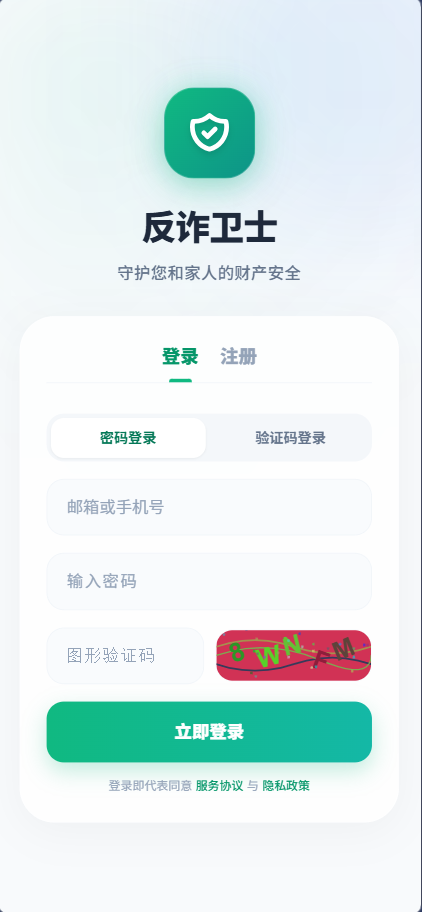

### 4.4 首次启动建议操作顺序

第一次进入时，建议按以下顺序完成：

1. 查看登录页。
2. 如果没有账号，先注册。
3. 如果已有账号，直接登录。
4. 登录后，优先打开通知权限。
5. 根据需要决定是否开启悬浮窗。
6. 根据需要决定是否开启无障碍守护。
7. 回到首页查看功能入口。

### 4.5 首次启动常见现象

首次打开时，可能遇到以下情况：

1. 页面需要加载几秒钟。
2. 验证码图片需要点击刷新。
3. 系统会提示授予通知权限。
4. 登录后可能自动跳转到首页。
5. 部分功能卡片可能因未授权而显示“未开启”状态。

这些都属于正常现象。

---

## 5. 登录、注册与账号进入系统

### 5.1 登录页整体布局

登录页包含以下区域：

1. 软件名称与副标题。
2. 登录与注册切换页签。
3. 密码登录与验证码登录切换按钮。
4. 手机号、邮箱、密码输入框。
5. 图形验证码区域。
6. 短信验证码区域。
7. 提交按钮。
8. 协议提示区域。

### 5.2 用户注册

#### 5.2.1 适用情况

如果您是第一次使用本系统，且还没有账号，请使用注册功能。

#### 5.2.2 注册前准备

注册前建议准备以下信息：

1. 用户名。
2. 邮箱地址。
3. 手机号。
4. 登录密码。
5. 可以接收短信验证码的手机。

#### 5.2.3 注册步骤

1. 在登录页点击“注册”。
2. 输入用户名。
3. 输入邮箱地址。
4. 输入手机号。
5. 输入密码。
6. 点击发送短信验证码。
7. 在短信框中输入验证码。
8. 如页面还有图形验证码，请先输入图形验证码。
9. 点击注册按钮。
10. 等待系统返回注册结果。

#### 5.2.4 注册成功后的表现

注册成功后，会出现以下一种或多种反馈：

1. 页面提示“注册成功”。
2. 系统自动跳转到已登录状态。
3. 页面回到首页。
4. 您的账号信息已保存到个人状态中。

#### 5.2.5 注册失败时的排查

如果注册失败，请优先检查以下几项：

1. 手机号是否输入正确。
2. 验证码是否过期。
3. 图形验证码是否看错。
4. 密码是否为空。
5. 网络是否稳定。
6. 手机号是否已被注册。

#### 5.2.6 注册使用建议

建议用户：

1. 选择自己记得住的密码。
2. 邮箱与手机号至少保证有一个长期可用。
3. 不要把验证码发给任何人。
4. 遇到他人索要验证码时立即停止操作。

### 5.3 密码登录

#### 5.3.1 适用情况

如果您已经注册过账号，且记得密码，可以直接使用密码登录。

#### 5.3.2 密码登录步骤

1. 在登录页点击“登录”。
2. 选择“密码登录”。
3. 在账号输入框中填写邮箱或手机号。
4. 在密码框中填写密码。
5. 如页面显示图形验证码，输入图形验证码。
6. 点击“立即登录”。
7. 等待系统返回登录结果。

#### 5.3.3 登录成功后的表现

成功登录后，会发生以下变化：

1. 页面自动跳转到主界面。
2. 底部导航开始可用。
3. 系统会提示“登录成功”。
4. 某些需要登录的功能入口变为可点击状态。

#### 5.3.4 登录失败常见原因

登录失败一般优先从以下方面排查：

1. 账号写错。
2. 密码写错。
3. 图形验证码写错。
4. 当前账号已在其他设备失效。
5. 网络波动导致请求未完成。

### 5.4 验证码登录

#### 5.4.1 适用情况

如果您不方便输入密码，或者更习惯短信验证方式，可以使用验证码登录。

#### 5.4.2 验证码登录步骤

1. 在登录页点击“登录”。
2. 选择“验证码登录”。
3. 输入手机号。
4. 点击“发送登录短信码”或相近按钮。
5. 接收短信验证码。
6. 把验证码输入页面。
7. 点击登录按钮。
8. 等待进入系统首页。

#### 5.4.3 验证码迟迟不到怎么办

如果验证码迟迟未收到，请依次检查：

1. 手机号是否填写正确。
2. 手机信号是否正常。
3. 短信是否被拦截到垃圾短信。
4. 是否频繁点击导致发送受限。
5. 是否需要等待倒计时结束后重试。

### 5.5 图形验证码

#### 5.5.1 图形验证码的作用

图形验证码用于确认当前操作来自真实用户，而不是异常请求。

#### 5.5.2 使用方法

1. 观察图片中的字符。
2. 按显示内容输入到验证码框。
3. 如果看不清，点击图片刷新。
4. 刷新后重新输入。

#### 5.5.3 常见错误

图形验证码常见错误包括：

1. 英文字母大小写看错。
2. 数字 0 和字母 O 混淆。
3. 图片已刷新，但输入了旧验证码。
4. 输入空格或多余字符。

### 5.6 登录后建议立即完成的设置

成功进入系统后，建议立即完成以下设置：

1. 开启通知权限。
2. 检查头像、昵称等个人信息是否正确。
3. 了解首页主要功能入口。
4. 如果有家人共同使用需求，尽早配置家庭中心。
5. 如果想要主动守护，请开启悬浮窗和无障碍能力。

### 5.7 退出登录

如果您需要切换账号，可以在“我的”或顶部个人菜单中找到退出登录按钮。

退出流程如下：

1. 进入“我的”页面。
2. 找到账号相关区域。
3. 点击“退出登录”。
4. 确认操作。
5. 系统返回登录页。

#### 5.7.1 退出后会发生什么

退出后一般会出现以下变化：

1. 受保护页面无法继续访问。
2. 再次使用核心功能需要重新登录。
3. 当前会话中的临时状态会被清空。

---

## 6. 首页与导航说明

### 6.1 首页的作用

首页是用户进入系统后的主工作台。

它的作用是帮助用户快速看到以下信息：

1. 当前守护状态。
2. 最近风险记录。
3. 常用分析入口。
4. 风险趋势概览。
5. 地区风险相关入口。
6. 快捷跳转到历史、消息、家庭、个人中心。

### 6.2 首页常见区域

首页主要包含以下区域：

1. 顶部欢迎区域。
2. 守护状态卡片。
3. 快速操作区。
4. 历史档案预览区。
5. 风险趋势分析区。
6. 地区风险信息区。

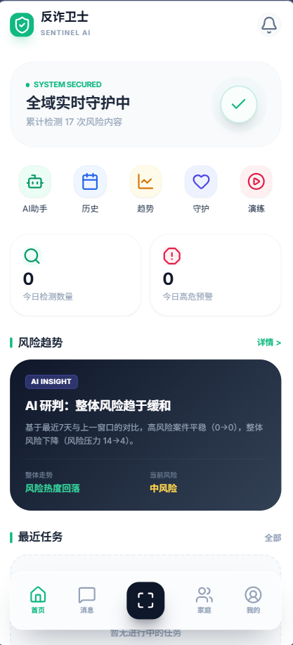

### 6.3 底部导航

底部导航包含以下入口：

1. 首页。
2. 消息。
3. 中间快捷分析按钮。
4. 家庭。
5. 我的。

#### 6.3.1 首页

用于查看总体守护状态、历史档案预览和趋势信息。

#### 6.3.2 消息

用于查看风险提醒、系统消息、告警信息等。

#### 6.3.3 中间快捷分析按钮

位于底部中间，视觉上最突出。

它用于快速进入可疑内容提交与分析页面。

#### 6.3.4 家庭

用于家庭创建、邀请、成员查看、守护关系设置和家庭通知查看。

#### 6.3.5 我的

用于查看个人资料、权限状态、隐私设置、退出登录等信息。

### 6.4 首页阅读建议

建议用户先看首页，不要一进入系统就直接乱点。

先理解三个重点：

1. 当前系统是否处于守护状态。
2. 最近是否有风险记录。
3. 底部中间的快捷分析按钮在哪里。

### 6.5 首页中的“历史档案”

历史档案区域显示以下内容：

1. 最近分析过的案件。
2. 每条记录的风险等级。
3. 提交时间。
4. 分析状态。
5. 点击后查看详细报告。

### 6.6 首页中的“风险趋势分析”

风险趋势区域用于展示：

1. 最近一段时间风险高低变化。
2. 历史高风险与低风险分布。
3. 总体风险变化趋势说明。

### 6.7 首页中的“地区风险信息”

地区风险信息用于帮助用户了解本地风险态势。

常见展示内容包括：

1. 今日风险情况。
2. 近 7 天风险变化。
3. 近 30 天风险变化。
4. 高发骗局类型。

### 6.8 首页中的“守护状态”

守护状态用于表达以下信息：

1. 是否开启通知。
2. 是否开启悬浮窗。
3. 是否开启无障碍守护。
4. 是否处于持续监测状态。

如果显示未开启，建议及时按系统引导完成授权。

---

## 7. 首次使用建议流程

### 7.1 为什么建议先走一遍完整流程

为确保在真正的高风险紧急场景中能迅速操作，建议您首次使用时在不着急的状态下预先完成一次完整流程体验和必要权限配置。

### 7.2 建议流程总览

建议首次使用按以下顺序操作：

1. 注册或登录。
2. 看首页。
3. 尝试做一次文本分析。
4. 看一次分析结果页。
5. 去历史里找到刚刚那条记录。
6. 进入 AI 助手提一个简单问题。
7. 开启通知权限。
8. 按需开启悬浮窗。
9. 按需开启无障碍守护。
10. 有家人共同使用需求时创建家庭。

### 7.3 第一次体验建议素材

如果您不知道第一次测试什么内容，可以用以下示例：

1. 一段陌生人要求转账的话术。
2. 一张客服退款截图。
3. 一段可疑语音。
4. 一段短视频链接说明。

### 7.4 第一次体验时应重点观察什么

第一次试用时，重点不是“结果一定完全正确”。

重点是先看清系统的工作方式：

1. 从哪里提交内容。
2. 提交后多久出结果。
3. 结果页有哪些字段。
4. 结果会不会保存到历史。
5. 提醒是怎么弹出来的。

---

## 8. 可疑内容分析总说明

### 8.1 分析功能的总体作用

分析功能是系统的核心能力，旨在将可疑内容交给系统智能识别，直接输出普通用户易于理解的判断结论。

### 8.2 支持的输入类型

当前系统支持以下主要输入形式：

1. 文本。
2. 图片。
3. 音频。
4. 视频。
5. 混合内容的综合分析。

### 8.3 两类使用思路

用户可以按两种思路使用：

1. 快速判断。
2. 深度分析。

快速判断适合时间紧张、只想先看风险高不高。

深度分析适合已经收集到较完整证据，希望得到更全面的解释和建议。

### 8.4 从哪里进入分析页面

常见入口包括：

1. 底部中间快捷分析按钮。
2. 首页快速操作区。
3. 悬浮球快捷入口。
4. 某些告警卡片上的“继续深度分析”按钮。

### 8.5 提交前的通用建议

无论分析哪种内容，提交前都建议先检查：

1. 内容是否尽量完整。
2. 截图是否清晰。
3. 音频是否能听清。
4. 视频时长是否太长。
5. 是否包含关键对话、金额、链接、身份说明等信息。

### 8.6 提交后的常见状态

提交分析后，会看到以下状态之一：

1. 已提交。
2. 分析中。
3. 已完成。
4. 分析失败。

### 8.7 分析失败不代表一定没有风险

如果分析失败，请不要误以为“没问题”。

分析失败意味着：

1. 内容上传不完整。
2. 网络波动。
3. 文件格式不支持。
4. 当前任务处理超时。

此时建议重新提交或换一种输入形式继续分析。

---

## 9. 深度分析操作说明

### 9.1 什么是深度分析

深度分析是系统对用户提交的各类潜在风险线索（包括文本、图片、音频、视频等）进行全面、综合的深入判断的过程。
无论您遇到什么类型的可疑情况，都可以在这一个页面内完成综合检测。

### 9.2 深度分析适用于哪些内容

深度分析支持多种格式的证据提交，包括：

1. **文字（文本框）：** 聊天记录、短信、客服话术、可疑链接附带说明等。
2. **图片：** 聊天截图、转账页面、退款流程图、二维码、冒充公检法通知截图等。
3. **音频：** 可疑语音消息、通话录音、带有催促转账或要求验证码的录音等。
4. **视频：** 屏幕录屏、假冒客服视频演示、涉及身份伪造或典型诈骗流程的短视频等。

### 9.3 进入深度分析页面

1. 点击或选择“深度分析”快捷入口。
2. 进入提交页面。

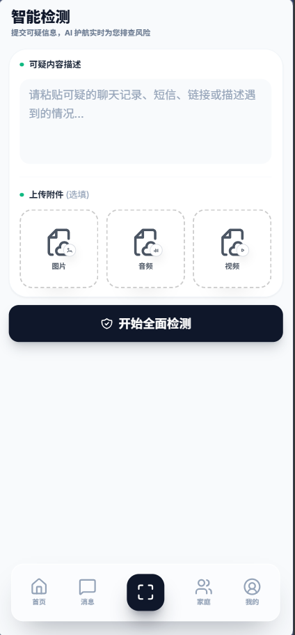

### 9.4 深度分析标准步骤

1. 打开分析页面。
2. 根据可疑内容的类型，上传对应格式的文件（支持文字、图片、音频或视频）。如果您有多种证据（如截图配合文字说明），建议同时提交以获得更精确的分析。
3. 检查提交信息是否完整。如果材料较长，建议重点挑选包含关键对话、涉及金额、操作指引等高危特征的部分。
4. 点击“开始全面检测”或同义按钮。
5. 等待系统处理。系统会根据证据的数量及音视频时长耗费不同时间。
6. 查看最终风险报告页面。

### 9.5 如何提高深度分析效果

建议在提交资料时尽量保留以下关键信息：

1. 对方自称的身份（如客服、公检法、朋友等）。
2. 对方要求您做什么（如转账、提供验证码、屏幕共享等）。
3. 是否提到“安全账户”“解除冻结”“影响征信”等恐吓引诱语。
4. 真实的沟通上下文（建议保留前后对话，不要只截取单句）。

### 9.6 各类文件上传建议

1. **文本输入：** 带上前因后果，如能体现出金额要求则最佳。
2. **图片上传：** 截图应完整无过度裁剪，确保金额、联系人清晰可见。字太小的图，可以在文本框里补充描述。
3. **音视频上传：** 大文件建议截取最关键的 1-3 分钟。若网络不稳定且文件较大可能导致失败，请尽量在网络良好时提交。

### 9.7 分析结果包含什么

检测完成后，您将得到一份详尽的报告。通常包含：

1. 综合风险等级。
2. 风险原因及分模态洞察（即文本、图像等分别被发现了什么异常）。
3. 抽取的关键风险提取物（如虚假网站链接、可疑账户等）。
4. 系统给出的防御建议动作。

关于结果页的详细解读，请继续参考下一章节《分析结果页面解读》。

---

## 10. 分析结果页面解读

### 10.1 结果页的作用

结果页用于直观解答“怎么看”的问题，展示风险等级、原因和操作指引，是阅读和理解风险的核心页面。

### 10.2 结果页常见组成

分析完成后，结果页由以下部分组成：

1. 风险等级区。
2. 诈骗类型区。
3. 风险原因区。
4. 关键风险信号区。
5. 综合分析报告区。
6. 分模态洞察区。
7. 建议动作区。
8. 历史归档信息区。

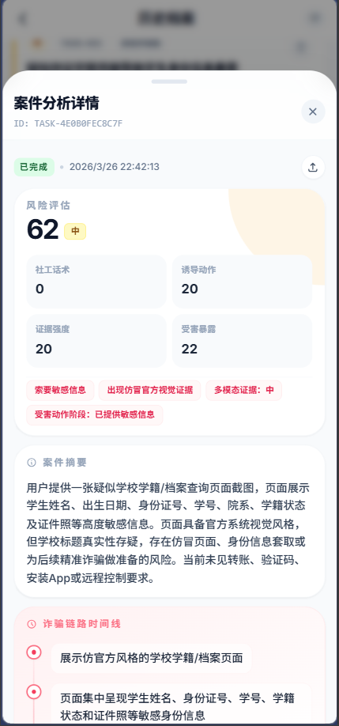

### 10.3 风险等级怎么看

系统会将结果分为以下等级：

1. 高风险。
2. 中风险。
3. 低风险。

#### 10.3.1 高风险

表示当前内容具有较强可疑性。

此时建议：

1. 立即停止转账。
2. 不要继续提供验证码。
3. 不要点击陌生链接。
4. 不要下载陌生应用。
5. 优先通过官方渠道核验。
6. 如已涉及资金，尽快采取止损措施。

#### 10.3.2 中风险

表示存在明显可疑点，但可能需要更多信息确认。

此时建议：

1. 暂缓继续操作。
2. 继续补充截图、文字或录音做深度分析。
3. 不要因为对方催促而仓促处理。
4. 先核验对方身份和渠道真实性。

#### 10.3.3 低风险

表示当前提交内容暂未发现明显高危特征。

但需要注意：

1. 低风险不等于绝对安全。
2. 如果后续出现转账、验证码、远程控制等要求，应重新分析。
3. 如果您主观上仍然强烈怀疑，也可以继续补充材料。

### 10.4 风险原因怎么看

风险原因会告诉您：

1. 为什么被判为高、中、低风险。
2. 系统看到了哪些可疑信号。
3. 哪些话术、图像、行为路径最值得警惕。

阅读时不要只看结论。

一定要看原因。

因为原因决定了您下一步怎么做。

### 10.5 关键风险信号怎么看

关键风险信号是结果页中非常重要的一块。

它常常比长篇报告更适合普通用户快速理解。

常见风险信号包括：

1. 冒充客服。
2. 冒充公检法。
3. 催促转账。
4. 索要验证码。
5. 要求共享屏幕。
6. 诱导下载应用。
7. 强调“官方”“紧急”“限时”。
8. 引导进入陌生链接或群聊。

### 10.6 综合分析报告怎么看

综合分析报告一般是对整件事的完整解释。

建议按以下顺序阅读：

1. 先看前两段总结。
2. 再看系统提到的主要证据。
3. 然后看最终建议。

如果报告较长，不必逐字细读。

重点是抓住：

1. 风险类型。
2. 风险理由。
3. 操作建议。

### 10.7 分模态洞察怎么看

如果您提交了多种内容，结果页可能会分别给出：

1. 图片分析洞察。
2. 音频分析洞察。
3. 视频分析洞察。

它们的作用是帮助您理解：

1. 哪一类证据提供了关键判断依据。
2. 不同模态各自发现了什么问题。
3. 哪条线索最值得优先重视。

### 10.8 建议动作怎么看

建议动作是结果页最需要立即执行的部分。

可能包括：

1. 停止转账。
2. 停止提供验证码。
3. 通过官方渠道核实。
4. 保留证据。
5. 通知家人。
6. 继续深度分析。

### 10.9 结果页中的“历史保存”含义

如果结果页提示已保存到历史，表示：

1. 这条记录后续可以在历史中再次查看。
2. 您不需要重新上传同一份材料才能回顾。
3. 这条记录可能参与后续风险趋势统计。

### 10.10 结果页适合截图分享给谁

如果结果明显为中高风险，建议您可以截图结果页，优先发给：

1. 家人。
2. 身边可信赖的人。
3. 银行或平台官方客服用于求助说明。

不建议发给可疑对象本人进行争辩。

---

## 11. 风险提醒与消息中心

### 11.1 消息中心的作用

消息中心主要用于集中查看系统提醒。

常见消息包括：

1. 分析结果提醒。
2. 风险告警提醒。
3. 家庭联防通知。
4. 其他系统状态提示。

### 11.2 从哪里进入消息中心

通过底部导航中的“消息”进入。

### 11.3 消息中心中可能看到什么

常见内容包括：

1. 告警卡片。
2. 风险等级标签。
3. 诈骗类型摘要。
4. 简短处理建议。
5. 点击后进入详情页。

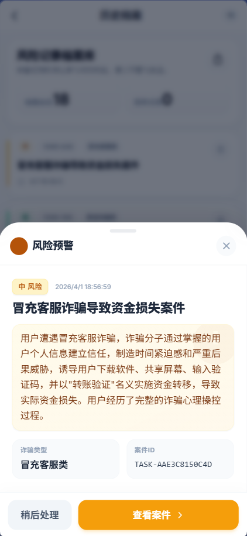

### 11.4 什么情况下会收到提醒

一般在以下场景中，系统会主动提醒：

1. 您提交的内容被判为中高风险。
2. 后台守护识别到高危页面或话术。
3. 家庭成员触发高风险事件。
4. 某些关键权限未开启，影响守护效果。

### 11.5 风险提醒弹出后应该怎么做

弹出风险提醒后，建议立即：

1. 暂停当前操作。
2. 阅读提醒摘要。
3. 进入详情页查看完整原因。
4. 按建议动作执行。

### 11.6 不要把提醒当作“打扰”

如果系统已经提醒，说明当前内容至少存在值得警惕的信号。

很多用户真正出问题，恰恰是因为忽略了第一时间的警报。

### 11.7 消息已读与未读

消息中心中一般会区分：

1. 未读消息。
2. 已读消息。

建议用户：

1. 对高风险消息不要只点开不处理。
2. 处理后再标记已读。
3. 重要消息可截图保留。

---

## 12. 风险历史查看与管理

### 12.1 风险历史的作用

风险历史用于保存您过去的分析记录。

它的价值不只是“能回看”。

还体现在：

1. 帮您复盘。
2. 帮您比较最近遇到的风险变化。
3. 帮您找回之前的报告。
4. 为长期守护提供背景。

### 12.2 从哪里进入历史

历史记录可从以下位置进入：

1. 首页中的历史档案区域。
2. 某些任务列表入口。
3. 结果页跳转到历史。

### 12.3 历史列表里有什么

历史列表会显示：

1. 记录标题或摘要。
2. 提交时间。
3. 分析类型。
4. 风险等级。
5. 当前状态。

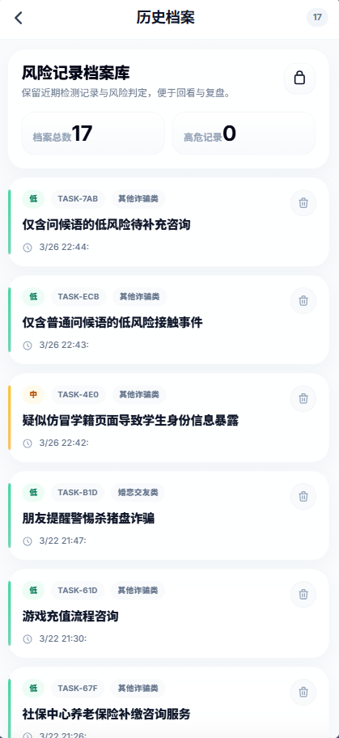

### 12.4 查看某条历史详情

操作步骤如下：

1. 进入历史列表。
2. 找到目标记录。
3. 点击卡片或详情按钮。
4. 进入结果详情页。
5. 阅读风险等级、原因和建议。

### 12.5 历史记录最适合什么时候看

历史记录适合在以下时间看：

1. 您冷静下来后复盘。
2. 您要给家人解释时。
3. 您怀疑对方是同一类骗局时。
4. 您想观察最近是否频繁接触高风险内容时。

### 12.6 历史记录删除

系统如果支持删除，会提供以下方式之一：

1. 单条删除。
2. 在详情页删除。
3. 列表长按删除。

删除前建议先确认：

1. 这条记录是否还需要留作证据。
2. 是否已经截图保存。
3. 是否还有家人需要查看。

### 12.7 删除后会怎样

删除后一般会出现以下变化：

1. 列表中不再显示该记录。
2. 再次查看时无法直接恢复。
3. 趋势统计中可能不再计入该条数据。

### 12.8 不建议随意删除哪些记录

以下记录不建议随意删除：

1. 已涉及转账的案件。
2. 已收到高风险结论的案件。
3. 已通知家人的案件。
4. 计划后续报警或申诉的案件。

---

## 13. 风险趋势分析说明

### 13.1 风险趋势分析的作用

帮助用户直观了解近期接触到的风险信息变化趋势，判断风险频率是在增多还是减少。

### 13.2 趋势页面包含什么

常见内容包括：

1. 时间维度切换。
2. 风险等级分布。
3. 趋势曲线或柱状图。
4. 系统自动生成的趋势摘要。

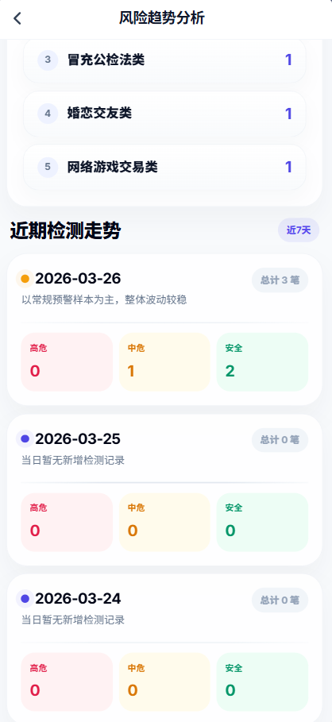

### 13.3 如何阅读趋势结果

阅读趋势时，建议先看：

1. 高风险是否增加。
2. 中风险是否持续存在。
3. 系统摘要有没有指出某类骗局频繁出现。

### 13.4 趋势分析对普通用户的意义

意义主要有：

1. 发现自己最近是否频繁受到骚扰。
2. 判断某一阶段是否遭遇同类骗局反复接触。
3. 帮助家庭守护人了解被守护成员的风险变化。

### 13.5 趋势分析不是最终证据

趋势图主要是辅助理解。

它不能替代具体某一条历史记录的详细证据。

如果需要具体说明某次风险，还是要点进那条历史详情查看。

---

## 14. 地区风险信息说明

### 14.1 地区风险信息的作用

地区风险信息帮助用户快速感知本地近期高发骗局，建立对本地风险态势的共识与防范意识。

### 14.2 常见信息内容

地区风险页展示：

1. 今日风险态势。
2. 近 7 天风险变化。
3. 近 30 天风险变化。
4. 高发骗局 Top 列表。
5. 简要说明或注释。

### 14.3 如何进入地区风险页面

可以从首页相关卡片点击进入。

### 14.4 如何使用地区风险信息

建议您这样使用：

1. 看本地近期高发骗局类型。
2. 对照自己收到的信息是否相似。
3. 提醒家人关注高发类型。

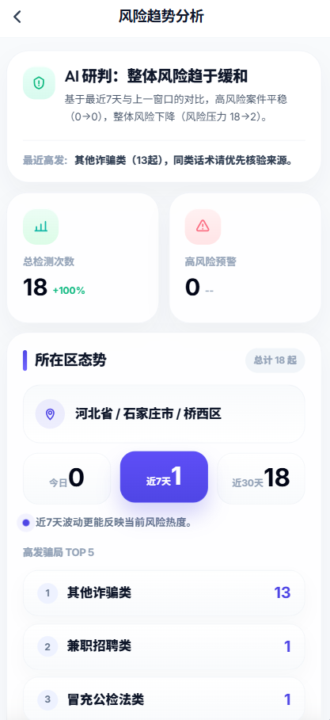

### 14.5 地区信息应如何理解

地区信息是参考态势。

它的意义在于提醒。

不是说“没上榜就绝对安全”。

如果您遇到的可疑内容不在当前高发列表中，也仍然需要按照实际内容进行分析。

---

## 15. AI 助手使用说明

### 15.1 AI 助手能做什么

AI 助手适合处理“我不确定，但想先问问”的情况。

它可以帮助您：

1. 解释某段话术是否可疑。
2. 告诉您现在该不该继续操作。
3. 提醒您核验的重点。
4. 基于上下文继续追问。
5. 对分析结果做进一步解释。

### 15.2 AI 助手不适合什么

AI 助手不适合代替您做所有事情。

尤其不建议：

1. 只问一句“安全吗”却不给上下文。
2. 把已经涉及资金的事件完全交给聊天判断而不做正式分析。
3. 把 AI 助手回复当作公安或银行正式结论。

### 15.3 进入 AI 助手

进入方式包括：

1. 首页快捷入口。
2. 单独的聊天模块。
3. 某次结果页中的继续咨询入口。

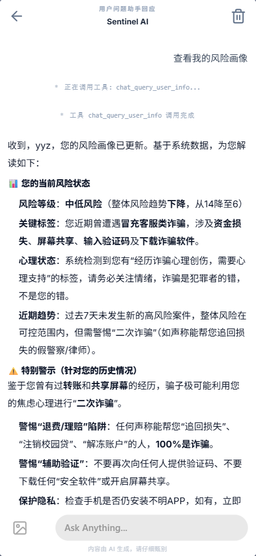

### 15.4 AI 助手标准使用步骤

1. 进入 AI 助手页面。
2. 在输入框中描述遇到的情况。
3. 尽量补充关键细节。
4. 点击发送。
5. 阅读助手回复。
6. 如果助手继续追问，请补充信息。
7. 如风险变高，转入正式分析页面。

### 15.5 推荐提问方式

为了让回答更有价值，建议按以下方式提问：

1. 对方自称是谁。
2. 对方让我做什么。
3. 是否提到验证码、转账、下载软件。
4. 我现在已经做到了哪一步。
5. 我最担心的是什么。

### 15.6 不推荐提问方式

以下提问方式不够有效：

1. “在吗？”
2. “帮我看看。”
3. “这是真的吗？”
4. “会不会被骗？”

这些提问过于空泛。

### 15.7 对话历史清除

系统支持清除对话历史。

清除步骤一般如下：

1. 进入聊天页面。
2. 找到清除或重置按钮。
3. 确认操作。
4. 对话恢复初始状态。

### 15.8 什么时候建议清除对话历史

建议在以下情况清除：

1. 新话题与旧话题完全无关。
2. 您不希望旧上下文影响新的判断。
3. 您想重新开始一次完整咨询。

### 15.9 AI 助手最适合的场景

最适合以下场景：

1. 尚未收集完整证据。
2. 想快速得到初步建议。
3. 想知道下一步应该上传什么材料。
4. 想理解某条结果中的专业表达。

---

## 16. 主动提醒与通知权限

### 16.1 为什么要开启通知权限

通知权限是主动守护的基础。

如果未开启，系统即使判断到了风险，也可能无法第一时间提醒您。

### 16.2 开启通知权限的基本路径

流程如下：

1. 登录后进入系统首页或“我的”页面。
2. 找到权限设置或守护设置。
3. 点击通知权限开关。
4. 跳转到系统权限页。
5. 允许通知。
6. 返回应用确认状态变为已开启。

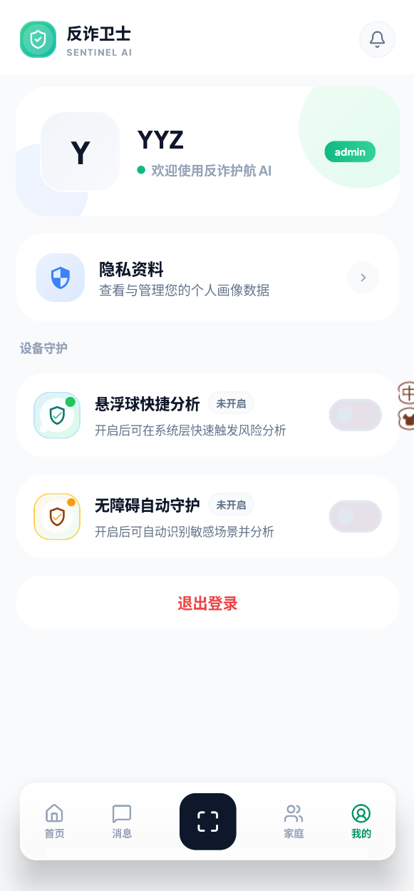

### 16.3 开启后如何确认成功

可以通过以下方式确认：

1. 开关状态显示已开启。
2. 首页守护状态变为正常。
3. 系统不会再反复提示您开启通知。

### 16.4 未开启通知会有什么影响

未开启通知可能导致：

1. 高风险时您收不到消息。
2. 后台守护提示无法及时弹出。
3. 家庭联防通知无法第一时间看见。

### 16.5 通知太多怎么办

如果您担心打扰，可以优先这样处理：

1. 不要直接关闭整个权限。
2. 优先检查是否频繁触发了同类可疑内容。
3. 根据实际需求调整使用习惯。

---

## 17. 悬浮窗快捷分析说明

### 17.1 什么是悬浮窗快捷分析

悬浮窗快捷分析是指在使用其他页面时，通过悬浮球快速触发风险识别。

它适合以下情况：

1. 正在聊天。
2. 正在浏览可疑网页。
3. 正在看支付页面。
4. 正在查看退款流程。

### 17.2 为什么推荐开启悬浮窗

因为真正遇到风险时，用户往往没有耐心再一步步打开应用。

悬浮球可以缩短操作路径。

### 17.3 开启悬浮窗的基本步骤

1. 进入“我的”或“守护设置”。
2. 找到悬浮窗功能开关。
3. 点击开启。
4. 跳转到系统设置。
5. 允许显示在其他应用上层。
6. 返回应用。
7. 确认悬浮球已出现。

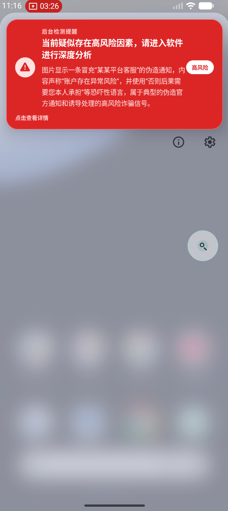

### 17.4 悬浮球如何使用

悬浮球这样使用：

1. 在任意页面看到悬浮球。
2. 点击悬浮球。
3. 触发当前页面的快捷识别或进入快捷分析。
4. 查看初步风险判断。
5. 需要时继续进入深度分析。

### 17.5 悬浮窗适合的场景举例

例如：

1. 微信聊天中对方突然要求转账。
2. 某网页弹出“订单异常，立即处理”。
3. 对方让您扫描二维码付款。
4. 某平台页面提示必须下载陌生应用。

### 17.6 悬浮球不显示怎么办

优先检查以下几项：

1. 是否授予了系统悬浮窗权限。
2. 是否被系统省电策略关闭。
3. 是否被某些安全软件拦截。
4. 应用是否已退出。

### 17.7 悬浮球不建议在什么情况下依赖

不建议把悬浮球当作唯一入口。

如果已经进入非常高压的诈骗场景，建议同时：

1. 停止操作。
2. 直接回到应用看详细结果。
3. 必要时联系家人。

---

## 18. 无障碍自动守护说明

### 18.1 什么是无障碍自动守护

无障碍自动守护用于帮助系统在手机页面中辅助识别高风险文字和操作引导。

它的目标是：

1. 让系统更早发现高危信号。
2. 在用户来不及手动分析前提供提醒。

### 18.2 什么时候建议开启

建议以下用户开启：

1. 家中老人。
2. 经常网购、刷短视频、接触陌生消息的人。
3. 希望获得更主动守护的人。

### 18.3 开启前需要理解什么

开启无障碍前，请先理解：

1. 该功能用于辅助识别风险。
2. 需要用户主动授权。
3. 授权后系统才能读取部分页面文本信息用于守护判断。

### 18.4 开启无障碍守护步骤

1. 进入应用中的守护设置。
2. 找到“无障碍守护”开关。
3. 点击开启。
4. 跳转到系统无障碍设置页。
5. 找到本应用。
6. 打开权限。
7. 按系统提示确认。
8. 返回应用检查状态是否已开启。

### 18.5 开启后会有什么变化

开启后，系统可能会：

1. 在检测到高风险页面时弹出提醒。
2. 提醒您某些话术或按钮存在风险。
3. 引导您不要继续操作。

### 18.6 无障碍守护更适合防什么

尤其适合以下风险：

1. 验证码索要。
2. 转账诱导。
3. 安全账户骗局。
4. 关闭会员类骗局。
5. 屏幕共享和远程控制诱导。

### 18.7 未开启无障碍时怎么办

如果您不想开启无障碍，也仍然可以：

1. 手动截图分析。
2. 使用悬浮球快捷分析。
3. 通过 AI 助手先咨询。

### 18.8 无障碍守护异常排查

如果您已开启但没有效果，可检查：

1. 系统是否把该权限自动关闭。
2. 应用是否在后台被清理。
3. 当前页面是否属于系统限制读取的场景。

---

## 19. 后台实时守护说明

### 19.1 什么是后台实时守护

后台实时守护是指系统在应用不处于前台时，也尽量保持基本风险感知和提醒能力。

### 19.2 后台守护的主要价值

能够在用户意外访问高危网页或遭遇风险操作时，提供即时的拦截与警示。

### 19.3 开启后台守护的建议步骤

1. 开启通知权限。
2. 开启悬浮窗或无障碍权限。
3. 检查系统是否限制后台运行。
4. 如有电池优化限制，按需放宽。

### 19.4 后台守护的实际体验

用户在日常使用中可能看到：

1. 通知栏风险提醒。
2. 悬浮提醒卡片。
3. 应用内弹窗。

### 19.5 没有收到后台提醒怎么办

优先检查：

1. 通知权限是否开启。
2. 应用是否被系统完全杀掉。
3. 是否限制了后台运行。
4. 是否开启了省电模式。
5. 是否相关权限未开启。

### 19.6 后台守护的正确预期

后台守护的目标是尽量及时提醒。

但不同设备品牌、系统策略、权限限制都可能影响表现。

因此不能把它理解为任何时候都百分之百替代手动判断。

---

## 20. 家庭中心总说明

### 20.1 家庭中心的作用

家庭中心用于建立家庭成员之间的协同守护关系。

它尤其适合以下场景：

1. 家人中有老人。
2. 家人中有人经常遇到陌生电话或消息。
3. 希望在高风险时第一时间通知守护人。

### 20.2 家庭中心能做什么

主要包括：

1. 创建家庭。
2. 加入家庭。
3. 邀请成员。
4. 查看家庭成员。
5. 设置成员角色。
6. 配置守护关系。
7. 接收家庭高风险通知。

### 20.3 从哪里进入家庭中心

通过底部导航“家庭”进入。

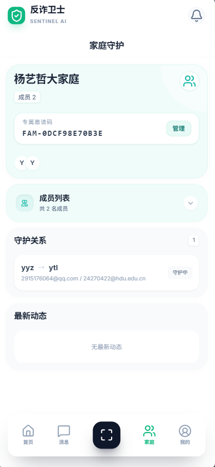

### 20.4 家庭中心适合谁优先配置

建议优先配置的人群：

1. 家庭创建者。
2. 守护人。
3. 需要被重点保护的家庭成员。

---

## 21. 创建家庭操作说明

### 21.1 什么情况下需要创建家庭

如果您希望由自己作为家庭的发起人来管理成员和守护关系，应先创建家庭。

### 21.2 创建家庭前建议准备

建议先想好：

1. 家庭名称。
2. 需要邀请的成员名单。
3. 哪位成员适合作为守护人。

### 21.3 创建家庭标准步骤

1. 进入家庭中心。
2. 点击“创建家庭”。
3. 输入家庭名称。
4. 点击确认创建。
5. 等待系统返回创建成功。

### 21.4 创建成功后的表现

成功后一般会看到：

1. 家庭名称显示在总览页。
2. 当前账号成为家庭创建者。
3. 出现邀请码或邀请入口。
4. 可以继续添加成员。

### 21.5 家庭名称怎么起更合适

建议：

1. 简洁。
2. 便于家人识别。
3. 不要使用容易混淆的名称。

---

## 22. 邀请家庭成员与加入家庭

### 22.1 邀请成员的作用

邀请成员是让家人加入同一个家庭组的必要步骤。

### 22.2 邀请方式

系统支持以下方式之一：

1. 发送邀请码。
2. 发送邀请记录。
3. 让对方在家庭中心输入邀请码加入。

### 22.3 邀请成员标准步骤

1. 家庭创建者进入家庭中心。
2. 点击“邀请成员”。
3. 选择成员角色。
4. 输入成员联系信息或生成邀请码。
5. 发送给对方。

### 22.4 被邀请人加入家庭步骤

1. 被邀请人登录自己的账号。
2. 进入家庭中心。
3. 找到“加入家庭”或“收到的邀请”。
4. 输入邀请码，或直接接受邀请。
5. 等待系统提示加入成功。

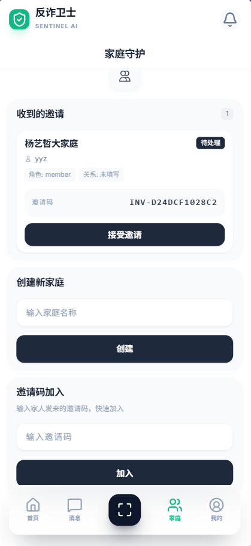

### 22.5 加入成功后应做什么

加入成功后建议立即：

1. 查看家庭总览是否正确。
2. 确认自己的角色。
3. 与家庭创建者确认是否需要配置守护关系。

### 22.6 加入家庭失败常见原因

常见原因包括：

1. 邀请码输入错误。
2. 邀请已过期或已处理。
3. 当前账号信息与邀请目标不匹配。
4. 用户已加入其他家庭。

---

## 23. 家庭成员管理说明

### 23.1 家庭成员列表能看什么

成员列表一般可以看到：

1. 成员名称。
2. 成员角色。
3. 成员关系说明。
4. 当前是否处于可守护配置范围。

### 23.2 家庭角色的一般含义

常见角色包括：

1. 家庭创建者。
2. 守护人。
3. 普通成员。

### 23.3 谁适合设置为守护人

更适合作为守护人的成员具备：

1. 经常在线。
2. 能及时看到提醒。
3. 能帮助判断风险。
4. 能在紧急情况下联系到被守护人。

### 23.4 不建议把所有人都设为守护人吗

不一定。

建议按真实家庭协作关系来配置。

如果所有成员都收到所有通知，可能反而造成混乱。

---

## 24. 守护关系配置说明

### 24.1 什么是守护关系

守护关系是指：

谁在某个家庭中负责接收谁的高风险通知。

### 24.2 守护关系为什么重要

因为家庭联防不是只要在同一个家庭里就自动生效。

还需要明确：

1. 谁守护谁。
2. 高风险时通知发给谁。

### 24.3 配置守护关系标准步骤

1. 家庭创建者或有权限的成员进入家庭管理。
2. 找到“配置守护”区域。
3. 选择守护人。
4. 选择被守护成员。
5. 点击保存。
6. 等待系统提示配置成功。

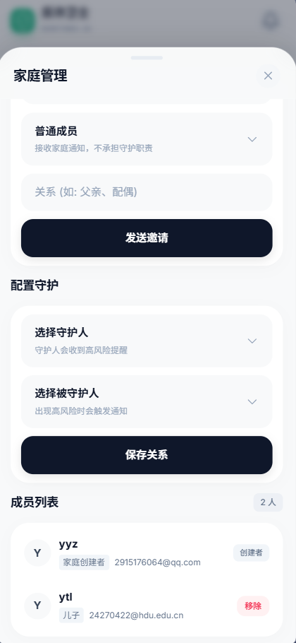

### 24.4 配置成功后如何确认

配置成功后会看到：

1. 列表新增一条守护关系。
2. 提示“守护关系配置成功”。
3. 家庭通知将按该关系进行推送。

### 24.5 修改或移除守护关系

如果家庭情况变化，可以：

1. 重新配置新的守护关系。
2. 删除旧关系。
3. 再次确认通知流向是否正确。

### 24.6 守护关系配置建议

建议注意以下几点：

1. 不要漏配高风险成员。
2. 守护人最好保持通知开启。
3. 守护人应理解收到通知后的处置责任。

---

## 25. 家庭联防通知说明

### 25.1 什么情况下触发家庭联防

在以下情况下触发：

1. 被守护成员产生高风险事件。
2. 该事件满足家庭通知条件。
3. 守护关系已正确建立。
4. 守护人的通知通道正常。

### 25.2 家庭联防通知会显示什么

家庭通知一般会包含：

1. 家庭成员名称。
2. 风险类型。
3. 风险摘要。
4. 时间信息。
5. 进入家庭中心查看详情的入口。

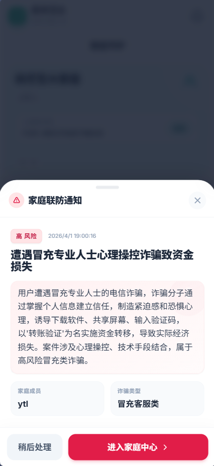

### 25.3 守护人收到通知后应该怎么做

建议立即：

1. 联系被守护成员。
2. 确认其是否正在操作转账或验证码。
3. 让其立刻停止可疑操作。
4. 指导其进入详情页查看完整结果。

### 25.4 被守护成员没有收到通知怎么办

家庭联防的重点是通知守护人。

如果被守护成员本人没有额外看到家庭通知，不代表系统失效。

应优先确认守护人是否收到。

### 25.5 守护人没有收到通知怎么办

优先检查：

1. 是否建立了守护关系。
2. 是否为高风险事件。
3. 守护人是否开启通知。
4. 家庭通知连接或状态是否正常。

---

## 26. AI 反诈模拟训练说明

### 26.1 模拟训练的作用

模拟训练不是用于处理真实案件。

它是用于帮助用户在安全环境中练习识骗。

### 26.2 适合谁使用

尤其适合：

1. 新用户。
2. 家中老人。
3. 学生群体。
4. 希望提升防骗意识的人。

### 26.3 模拟训练能带来什么

它可以帮助用户：

1. 识别常见诈骗套路。
2. 练习遇到风险时该如何选择。
3. 发现自己的防骗薄弱点。
4. 获取针对性的改进建议。

### 26.4 进入模拟训练

可从首页快捷入口或独立模块进入。

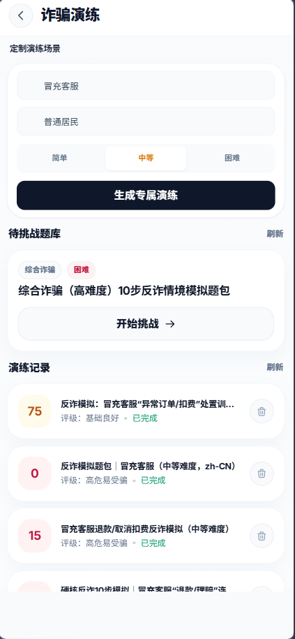

### 26.5 开始一套新的模拟训练

1. 进入模拟训练模块。
2. 选择生成或进入题包。
3. 查看题目简介。
4. 点击开始答题。

### 26.6 答题过程一般如何进行

1. 阅读题干。
2. 理解当前场景。
3. 从多个选项中选择您认为最安全的做法。
4. 提交当前题目。
5. 进入下一题。
6. 完成全部步骤后查看报告。

### 26.7 模拟训练结果怎么看

结果包括：

1. 总分。
2. 意识等级。
3. 薄弱点。
4. 优势项。
5. 改进建议。

### 26.8 模拟训练的正确使用方式

建议：

1. 不要只追求高分。
2. 重点看自己为什么错。
3. 和家人一起复盘。
4. 定期再练一次不同题包。

### 26.9 模拟训练与真实分析的区别

区别在于：

1. 模拟训练用于学习。
2. 真实分析用于应对当前事件。

不要把模拟训练结果当作某个真实案件的正式判断。

---

## 27. 我的页面与个人设置

### 27.1 我的页面包含什么

“我的”页面用于管理个人相关内容。

常见项目包括：

1. 个人资料。
2. 权限状态。
3. 隐私设置。
4. 退出登录。
5. 可能还有帮助说明或版本信息。

### 27.2 在“我的”中建议重点看什么

建议优先关注：

1. 通知是否开启。
2. 悬浮窗是否开启。
3. 无障碍守护是否开启。
4. 当前账号是否正确。

### 27.3 权限状态排查

如果某功能失效，建议先到“我的”检查权限状态。

不要先默认系统出错。

很多问题其实都是权限未打开。

---

## 28. 用户操作建议总表

### 28.1 快速建议总表

| 场景 | 建议入口 | 建议动作 |
| --- | --- | --- |
| 聊天中对方催转账 | 悬浮球或快捷分析 | 先分析，先不要转账 |
| 收到可疑截图 | 图片分析 | 上传截图并补充说明 |
| 接到可疑语音 | 音频分析 | 上传录音并查看关键话术 |
| 刷到可疑视频 | 视频分析 | 上传关键片段做深度分析 |
| 拿不准是否诈骗 | AI 助手 | 先问，再补材料 |
| 想回看过去记录 | 历史档案 | 查看详细报告 |
| 想和家人联动 | 家庭中心 | 创建家庭并配守护关系 |
| 想提前练习 | 模拟训练 | 开始答题并复盘 |

### 28.2 高风险场景总原则

只要系统给出高风险，建议统一遵循：

1. 停。
2. 查。
3. 留。
4. 说。

这四个字分别代表：

1. 停止当前操作。
2. 查验官方渠道。
3. 保留证据。
4. 告知家人或可信人员。

---

## 29. 典型用户场景操作示例

### 29.1 场景一：冒充客服退款

#### 29.1.1 场景描述

您收到一条消息，对方自称平台客服，说您开通了某项服务，需要立即取消，否则会自动扣费。

#### 29.1.2 推荐操作

1. 不要直接点击对方发来的链接。
2. 先把聊天内容复制或截图。
3. 进入分析页提交文本或图片。
4. 查看风险等级。
5. 如果为高风险，停止一切转账和下载行为。

#### 29.1.3 结果后续动作

1. 通过官方 App 或官方客服电话核验。
2. 不要从消息中直接回拨陌生号码。
3. 如有需要，把结果截图发给家人确认。

### 29.2 场景二：要求提供验证码

#### 29.2.1 场景描述

对方说需要验证码确认身份、退款、解冻、注销服务。

#### 29.2.2 推荐操作

1. 不要发送验证码。
2. 把对方话术粘贴到文本分析或 AI 助手。
3. 查看系统建议。
4. 立即中止当前沟通。

### 29.3 场景三：家中老人收到高风险提醒

#### 29.3.1 场景描述

家庭守护人收到系统推送，说被守护成员触发高风险案件。

#### 29.3.2 推荐操作

1. 守护人立即联系被守护成员。
2. 询问其是否正在转账或下载应用。
3. 指导其停止操作。
4. 一起查看系统结果详情。

### 29.4 场景四：看到可疑视频

#### 29.4.1 场景描述

您刷到一个短视频，内容在引导去某个平台领补贴或高收益理财。

#### 29.4.2 推荐操作

1. 保存视频关键片段。
2. 进入视频分析。
3. 查看是否包含导流、诱导转账或身份伪装。
4. 不要按视频指引直接操作。

---

## 30. 常见问题与排障说明

### 30.1 为什么我登录不上

请依次检查：

1. 账号是否正确。
2. 密码是否正确。
3. 图形验证码是否正确。
4. 网络是否可用。
5. 验证码是否过期。

### 30.2 为什么验证码收不到

请依次检查：

1. 手机号是否填错。
2. 短信是否被拦截。
3. 是否频繁发送导致限流。
4. 是否需要等待倒计时结束。

### 30.3 为什么图片上传不了

常见原因包括：

1. 未授予媒体权限。
2. 图片损坏。
3. 网络波动。
4. 图片格式不支持。

### 30.4 为什么分析很慢

可能原因：

1. 当前做的是深度分析。
2. 上传了音频或视频。
3. 网络不稳定。
4. 任务处理中需要更多时间。

### 30.5 为什么结果没有直接写“诈骗”

系统输出的是风险判断和建议。

原因在于：

1. 风险场景有时需要综合多项证据。
2. 系统强调谨慎、可解释和辅助决策。

### 30.6 为什么没有收到风险提醒

请优先检查：

1. 通知权限是否开启。
2. 应用是否在后台被清理。
3. 是否关闭了相关守护能力。
4. 是否只是低风险，不满足主动提醒条件。

### 30.7 为什么悬浮球不见了

请优先检查：

1. 是否开启了悬浮窗权限。
2. 系统是否限制后台显示。
3. 应用是否退出。

### 30.8 为什么家庭成员没有收到通知

优先排查：

1. 是否配置了守护关系。
2. 当前事件是否达到高风险。
3. 守护人通知权限是否开启。

### 30.9 为什么历史记录找不到了

可能原因：

1. 您切换了账号。
2. 该记录被删除了。
3. 当前任务尚未完成归档。

### 30.10 为什么 AI 助手回答得还不够明确

是因为上下文不够完整。

建议补充：

1. 对方身份。
2. 要求动作。
3. 已进行到哪一步。
4. 是否已转账。

### 30.11 为什么无障碍守护没有反应

可能原因：

1. 权限被系统回收。
2. 后台运行被限制。
3. 当前页面不在可识别范围。

### 30.12 遇到高风险后最先做什么

最先做的不是和对方争辩。

而是：

1. 停止操作。
2. 保留证据。
3. 看系统建议。
4. 联系官方或家人。

---

## 31. 风险防范操作清单

### 31.1 一旦系统判为高风险，请立即执行

1. 停止转账。
2. 不要提供验证码。
3. 不要下载陌生软件。
4. 不要共享屏幕。
5. 不要继续点击对方发来的链接。
6. 保存聊天截图。
7. 保存转账页面截图。
8. 保存通话或语音证据。
9. 联系家人。
10. 通过官方渠道核验。

### 31.2 如果已经转账怎么办

建议立即：

1. 停止继续转账。
2. 保留证据。
3. 联系官方平台或银行。
4. 告知家人。
5. 继续使用系统整理证据线索。

### 31.3 如果已经泄露验证码怎么办

建议立即：

1. 修改相关账户密码。
2. 核验资金和账户状态。
3. 联系官方渠道处理。

### 31.4 如果已经安装陌生应用怎么办

建议：

1. 停止继续授权。
2. 不要继续登录支付类账号。
3. 尽快处理风险。

---

## 32. 注意事项

### 32.1 使用注意事项

1. 本软件用于辅助识别风险，不代替官方结论。
2. 高风险场景下不要继续尝试“和对方周旋”。
3. 验证码、密码、支付口令都不应告诉陌生人。
4. 遇到转账催促时，先停一步再分析。

### 32.2 家庭使用注意事项

1. 家庭守护功能应在知情同意下使用。
2. 守护人应承担及时响应的责任。
3. 不建议滥用守护关系造成家庭骚扰。

### 32.3 权限使用注意事项

1. 权限越完整，主动守护效果越好。
2. 如果不需要某功能，可以按需不开启。
3. 若发现系统权限被自动关闭，应及时重新检查。

---

## 33. 术语说明

### 33.1 快速分析

指快速给出初步风险判断的使用方式。

### 33.2 深度分析

指提交更完整材料后生成更完整报告的使用方式。

### 33.3 风险等级

指系统对当前内容危险程度的分级结果。

### 33.4 历史档案

指用户过去提交并保存下来的分析记录。

### 33.5 守护关系

指家庭中谁负责接收谁的高风险通知。

### 33.6 家庭联防

指高风险事件发生后，系统将信息联动给守护人。

### 33.7 模拟训练

指在非真实诈骗场景中练习识骗决策的功能。

---

## 34. 结语

《反诈卫士（Sensible AI）》的核心目标，不是让用户背会很多技术名词。

而是帮助用户在真正紧张、混乱、时间被催促的场景中，多一个稳定、清晰、可操作的判断入口。

建议用户记住以下三点：

1. 有疑问先分析。
2. 有提醒先停止。
3. 有高风险先联系官方和家人。

