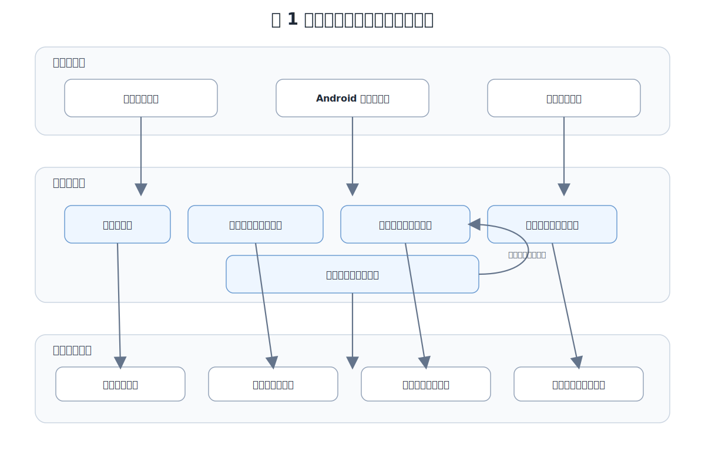
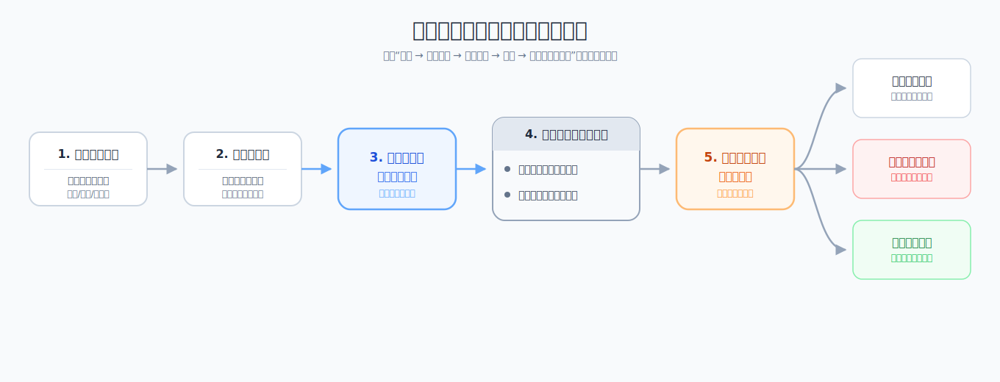
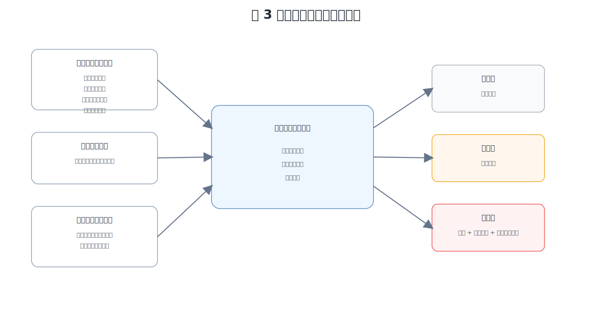
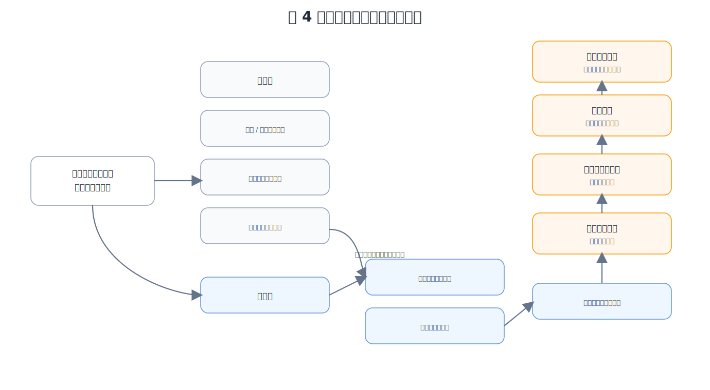
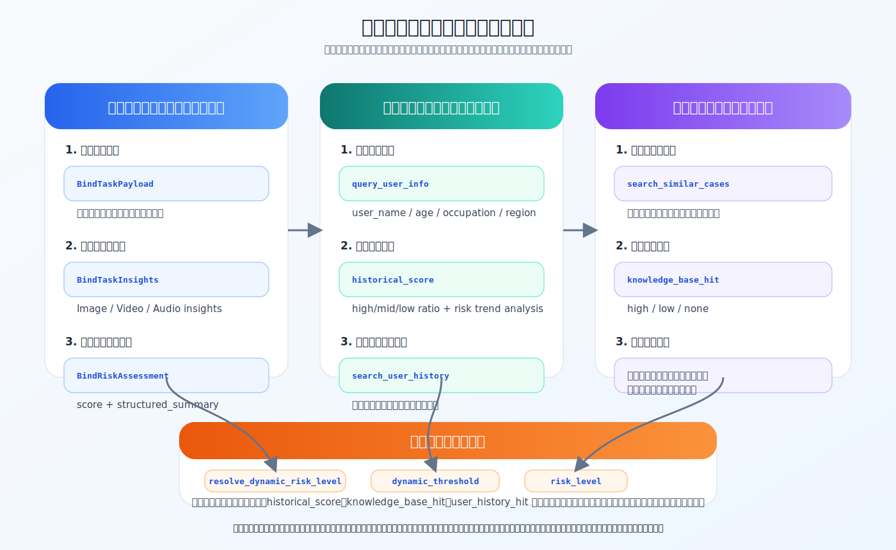

# 反诈卫士（Sentinel AI）项目详细方案

## 一、前言

电信网络诈骗已经从传统短信、电话诈骗演变为跨平台、跨模态、跨流程的复杂风险问题。普通用户在真实生活中遇到的，往往不是一段规则化文本，而是聊天记录、转账页面、伪造通知、仿冒客服界面、语音片段、短视频、安装包链接等混合证据。面对这种复杂表达，单纯依赖关键词匹配或一次性问答的反诈方式，已经很难在关键时刻帮助用户及时识别风险。

反诈卫士（Sentinel AI）项目希望解决的并不是“识别一条诈骗文本”这样单点问题，而是构建一套面向真实生活、能够长期使用、能够持续成长的智能反诈服务方案。项目围绕普通用户、家庭守护和管理治理三个层面展开，通过多模态分析、双重知识支撑、动态风险分级、主动提醒、家庭联防和案例治理闭环，把“识别、提醒、联动、沉淀、进化”串成一条完整链路。

本详细方案在材料一基础上进一步展开，重点说明项目的技术路线、功能机制、系统实现、业务组织和推广可行性，体现项目不是停留在创意层面的概念设计，而是已经形成较完整的工程化解决思路。

项目代码仓库网址为：`https://github.com/Yyzfddsdf/AntiFraud-AI-Assistant.git`。后续方案说明均以该项目提交资料与代码实现为基础展开。

## 二、项目背景与问题分析

### 2.1 社会背景

当前诈骗已经广泛渗透到社交聊天、电商客服、兼职招聘、投资理财、教育培训、支付转账、平台退款、虚假公检法通知等高频场景。诈骗话术也不再只依靠文字，而是大量借助截图、仿冒页面、语音引导、视频包装和链接跳转提升迷惑性。随着生成式 AI 的发展，诈骗内容在语音、图像、视频上的伪装能力还在持续增强。

这意味着反诈系统如果仍然只面向单一文本场景，就难以覆盖真实生活中的主要风险入口。更关键的是，很多受骗行为发生在“用户犹豫但还没来得及求助”的短窗口内，等到用户主动去搜索、询问或报案时，损失往往已经发生。

### 2.2 现有方案的不足

结合当前反诈产品和大众真实使用场景，可以归纳出现有方案的几个典型短板：

1. 对复杂证据支持不足。很多工具只能处理文本，对图片、音频、视频等非结构化证据理解不够。
2. 偏被动响应。多数产品依赖用户主动搜索或上传，缺少事中提醒和主动防护。
3. 缺乏个体连续记忆。用户过去遇到过什么骗局、近期风险状态如何，往往不会真正参与后续判断。
4. 家庭协同能力弱。对于老人、学生或高风险群体，家人往往是最关键的干预力量，但很多系统只服务单个用户。
5. 治理闭环不完整。系统对新案例缺少稳定的沉淀、审核和再利用机制，长期看容易落后于诈骗手法变化。

### 2.3 用户需求

围绕上述问题，目标用户的核心需求并不是抽象的“更智能”，而是以下几项非常具体的能力：

1. 当接触到可疑内容时，能够快速得到可信判断。
2. 系统不仅能看文字，还能看图、听音频、理解视频。
3. 当风险上升时，系统最好能主动提醒，而不是完全依赖用户自己察觉。
4. 系统能够记住用户过去的风险经历，避免类似骗局反复发生。
5. 在高风险时刻，家庭成员能够介入，形成止损帮助。
6. 管理侧能够持续沉淀案例、审核知识、做态势分析，而不是只做前台识别。

## 三、项目目标与总体思路

### 3.1 项目目标

本项目围绕“面向大众的多模态智能反诈服务”这一定位，设定了以下核心目标：

1. 建立覆盖文本、图片、音频、视频的多模态诈骗识别能力。
2. 将风险识别、风险报告、历史归档、主动提醒和家庭联动串成完整闭环。
3. 通过历史案件知识库和用户个性化记忆，让系统具备持续学习和个体化防护能力。
4. 提供用户侧服务、守护侧联动和管理侧治理的完整产品形态。
5. 在技术上证明方案可实现、可扩展、可持续演进。

### 3.2 总体思路

项目整体采用“用户侧服务 + 守护侧联动 + 管理侧治理”的三层思路。

1. 用户侧负责接收可疑内容、输出风险判断、查看历史记录、使用聊天式辅助决策，并承接移动端主动守护入口。
2. 守护侧负责高风险场景下的家庭联动提醒，让反诈从个人自救延伸到家庭协同。
3. 管理侧负责案例审核、后台采集、统计分析、地图态势和知识图谱画像，支撑系统持续进化。

从能力结构上看，本项目不是把若干功能简单拼接，而是形成一条连续链路：用户输入可疑信息后，系统先做多模态取证和风险评估，再结合公共知识和个体历史完成动态判级，输出结构化报告，随后把案件归档为用户历史，并在需要时触发主动提醒、家庭联动和案例入库流程。

## 四、总体解决方案

### 4.1 整体架构

项目整体可以概括为三层架构：

1. 交互承载层：负责用户与管理员的实际使用入口，包括移动端前端、桌面管理端和移动主动守护场景。
2. 业务服务层：负责认证鉴权、多模态分析、聊天辅助、家庭系统、案例治理、统计分析和实时告警。
3. 数据与知识层：负责主业务数据、历史归档、案件知识库、用户历史向量索引、缓存和实时会话数据。

图 1 展示了项目从用户侧服务、移动端主动守护到管理端治理支撑的整体方案结构，体现识别、提醒、联动、沉淀、进化的闭环思路。

### 4.2 方案主链路

项目最核心的主链路并不是“模型直接给答案”，而是一条有明确状态、有明确工具顺序、有明确终态的服务链路：

`POST /api/scam/multimodal/analyze -> 创建 pending 任务 -> 异步队列处理 -> 任务转 processing -> 图像/视频/音频子智能体并发产出洞察 -> 主智能体聚合文本与多模态证据 -> 工具调用链 -> 生成最终报告 -> 写入历史归档 -> 写入用户历史向量索引 -> 高风险事件回调家庭系统 -> 任务转 completed`

这条链路的关键点在于：

1. 子智能体只负责模态级证据提取，不直接落库，不直接生成最终结论。
2. 主智能体在统一上下文中完成检索、评估、判级和报告生成。
3. 历史归档是终态必选步骤，不会因为是否入知识库而缺失。
4. 家庭联动与主分析链路解耦，只在高风险历史事件产生后通过回调触发。

图 2 展示了项目从多模态证据输入、聚合分析、风险判级到历史归档、联动提醒和治理沉淀的完整主链路，说明系统具备可追踪、可闭环的服务流程。

### 4.3 三端协同思路

本项目不是单一后端工程，而是围绕三类角色组织能力：

1. 普通用户端：查看分析结果、历史记录、聊天辅助、风险趋势与家庭中心。
2. 移动守护端：承接高频主动防护需求，包括快判、提醒和高风险联动入口。
3. 管理员端：承接案例审核、后台案件采集、统计总览、区域风险地图和知识图谱画像。

项目代码体系覆盖用户侧、管理员侧与 Android 主动守护相关能力。其中，`frontend/mobile-vue` 和 `frontend/desktop-vue` 分别承载移动端前端与桌面管理端前端；Android 端则承接悬浮球快捷识别、无障碍自动守护、后台提醒等更贴近真实手机使用路径的主动防护能力。

## 五、核心功能与关键技术方案

### 5.1 多模态联合分析机制

系统支持文本、图片、音频、视频等多种输入形态。为避免所有模态都直接堆到一个模型里做黑盒判断，项目采用“子智能体取证 + 主智能体决策”的多智能体协同机制，并且全部采用原生多模态模型，防止ASR, OCR等中间步骤引入误差。

其基本分工如下：

1. 图像子智能体：提取页面文字、界面元素、仿冒视觉线索、金额信息、账号信息等图像证据。
2. 视频子智能体：提取画面主题、字幕、连续场景变化和诱导性动作线索。
3. 音频子智能体：提取语音内容、催促语气、威胁性表达、诱导动作请求等。
4. 主智能体：整合文本输入与多模态洞察，调用知识检索、用户画像、风险评估、动态判级和报告工具，生成最终结构化结论。

这种设计有两个直接价值：

1. 模态级提取和最终决策分离，减少单一步骤负担，提高可解释性。
2. 每个子智能体只承担本模态结构化任务，主智能体只在已抽取证据的基础上做统一判断，更利于后续维护与扩展。

### 5.2 主智能体工具闭环

项目的技术深度不只体现在“用了大模型”，更体现在工具闭环是明确设计和落地的。主智能体在统一上下文中按顺序调用以下关键工具：

1. `query_user_info`：读取当前用户画像、近期标签和 `historical_score`。
2. `search_similar_cases`：从全局历史案件知识库召回语义相似案例。
3. `search_user_history`：从用户历史语义索引中召回相似案件。
4. `update_user_recent_tags`：可选，更新近期风险标签。
5. `submit_current_risk_assessment`：只根据当前案件事实计算基础风险分。
6. `resolve_dynamic_risk_level`：结合 `historical_score` 和命中情况计算最终风险等级。
7. `submit_final_report`：生成最终结构化报告。
8. `upload_historical_case_to_vector_db`：可选，将典型案件写入待审核案例队列。
9. `write_user_history_case`：必选终态步骤，把当前案件写入用户历史归档并建立向量索引。

这一闭环的关键不是工具数量，而是顺序约束。比如：

1. `resolve_dynamic_risk_level` 依赖 `query_user_info` 提供的 `historical_score`。
2. `write_user_history_case` 依赖前面已经生成的风险评估结果和最终报告。
3. 案件送审是可选步骤，但历史归档是必选步骤。

因此，系统不是“让模型随便调用几个函数”，而是把工具调用组织成一条可验证、可追踪、可终态收敛的业务流程。

### 5.3 当前案件风险判断逻辑

项目对“当前案件有多危险”的判断，并不是让模型直接给出一个笼统结论，而是先对当前案件本身进行结构化评估，再把结果作为后续动态分级的基础。

从机制上看，系统会综合考虑四类信息：

1. 社会工程学铺垫特征，如冒充客服、冒充官方、冒充熟人、紧迫催促、恐吓施压、利益诱导、逐步建立信任等。
2. 前期推进信号，如引导切换线路/平台、索要邀请码或口令、前置认证/额度验证、要求截图/录屏、诱导点击链接或安装应用等。
3. 终局危险动作，如转账、验证码、远程控制、敏感信息提供、向私人账户收款等。
4. 多模态证据强度与用户暴露阶段，如图像、音频、视频中是否存在较强风险线索，以及用户是否已从“可疑接触”进入“实际暴露”阶段。

这样的设计有两个作用：

1. 先把当前案件事实本身评估清楚，避免一开始就被历史信息带偏。
2. 把风险判断拆成可解释的维度，而不是只给出一句高危或低危结论。

因此，本项目的当前案件判断机制本质上是一种“多维风险因子聚合评估”。它既关注诈骗话术和前期推进方式，也关注用户是否已经进入真正的损失暴露阶段，从而为后续的动态分级提供相对客观的基础。当前实现中，命中的细粒度风险因子会被统一整理为结构化规则标签，便于后续报告解释与前端动态展示。

### 5.4 动态阈值与最终风险分级逻辑

在当前案件评估基础上，系统还会进一步进行动态风险分级。这里的核心思想是：不同用户的风险背景不同，因此不适合用完全统一的固定阈值做一刀切判断。

系统在最终分级时会综合参考三类信息：

1. 当前案件本身的多个风险因子评估。
2. 历史案件知识库中的相似案例情况。
3. 用户个人历史风险状态与既往相似经历。

这意味着，系统既不会脱离当前案件事实单独做“历史先验判断”，也不会忽视用户本身的风险背景。对于近期风险暴露较高、且又命中相似高风险案例的用户，系统会采用更积极的提醒策略；对于历史风险较低、且缺乏高风险相似支持的情况，系统则会保持更审慎、更克制的分级。历史中的低风险命中只作为边界校准，不会直接压制当前已经出现的前期诈骗链路，更不会把明显具备推进信号的样本简单拉回低风险。

这一机制的价值主要体现在三个方面：

1. 让系统能够实现“同类事件、不同用户、不同判断”的个体化防护。
2. 避免固定阈值在复杂场景中带来的机械误判。
3. 通过当前案件、公共知识和个人历史三者结合，提高风险判断的可靠性与解释性。

因此，本项目的最终风险分级不是简单标签化处理，而是建立在“当前案件评估 + 双重知识支撑 + 动态调整”基础上的统一判级框架。

图 3 展示了项目基于当前案件评估、公共知识支撑和用户个体历史三类信息进行动态风险分级的机制，体现了项目在复杂场景下的个体化判断能力。

#### 5.4.1 动态阈值案例对照验证

动态阈值机制的价值，不只在于理论上“可以因人而异”，更在于它能够在相似案件中体现真实分级差异。项目当前已具备对应验证基础：在相同或高度相似的诈骗事件中，系统会同时参考当前案件事实、公共知识命中和用户个人历史风险状态，因此不同用户即使面对相近情境，也可能得到不同的最终风险等级。

这种差异并不是随意波动，而是由以下因素共同决定：

1. 当前案件基础风险分是否已经接近高风险区间。
2. 历史案件知识库是否命中高风险相似案例。
3. 用户历史语义记忆中是否出现过相似高风险事件。
4. `historical_score` 对动态阈值的拉低或抬高作用。
5. 低风险命中是否仅处于边界校准区间，而未覆盖当前案件中的前期诈骗推进信号。

因此，动态阈值判级的意义在于：系统不是只回答“这个内容像不像诈骗”，而是进一步回答“对这个用户来说，现在需要多强的提醒和干预”。这也是项目相较于固定阈值方案更具辨识度的核心点之一。

### 5.5 双重知识支撑：公共知识库与用户个性化记忆

项目没有把知识检索仅仅当作一个可有可无的外挂能力，而是把它直接纳入最终判级逻辑。

系统构建了两层知识支撑：

1. 全局历史案件知识库：用于提供公共层面的相似案例先验。
2. 用户个性化历史记忆：用于识别“这个用户是否又遇到了类似风险”。

这种设计与传统只查公共案例库的做法相比，多了一层个体连续性。它可以帮助系统识别两类风险：

1. 新案件虽然文本表述变化，但本质上与用户过去高风险经历高度相似。
2. 某个用户近期连续暴露在类似骗局下，说明需要更积极的提醒阈值。

### 5.5.1 管理端全景分析与类型画像的对应关系

为了避免把前端展示层误写成独立算法模块，这里补充说明管理员端几个核心页面与后端逻辑的对应关系。

1. 管理员端的“全景分析”不是一套新的判别算法，而是对后端已沉淀结果的可视化承载，主要展示案件入库趋势、诈骗类型分布、目标人群分布、知识图谱关系和类型画像等内容。
2. 其中“类型画像”对应的是后端基于 `historical_case_library` 聚合得到的诈骗类型统计、风险分布、高频目标人群、高频关键词和相似类型结果，其数据基础来自案件库聚合与图谱分析能力，而不是前端临时计算。
3. “相似度”则来自真实的检索与判级链路：`search_similar_cases` 负责从全局历史案件知识库做向量召回，`search_user_history` 负责从用户历史语义索引中召回相似经历，最终再由动态阈值逻辑综合当前案件事实、公共先验和用户历史状态输出风险等级。
4. 因此，管理员端页面中的“全景分析 / 类型画像 / 地区案件统计 / 案件审核 / 案件库”，本质上分别对应知识聚合展示、相似案例先验、区域风险统计、待审核治理闭环和正式知识库沉淀等后端能力。
5. 这样写的好处是，比赛材料中的页面命名与工程实现能够一一对齐，既保留产品展示感，也不会把展示层误表述为新的算法模块。

### 5.6 知识治理与管理员审核闭环

如果知识库直接允许自动写入，错误案例会进入后续检索和判级流程，进而放大误判风险。项目因此没有采用“自动抓取后直接入库”的激进方式，而是采用“待审核入库 + 管理员审核”的治理闭环。

其流程如下：

1. 主分析链路在识别到典型案例时，可将其提交至待审核案例库。
2. 案例不会直接进入正式知识库，而是先进入待审核区进行质量控制。
3. 入审核前，系统会先做相似性比对与重复性校验，避免明显重复案例反复进入治理流程。
4. 管理员审核通过后，案例才会进入正式知识库，参与后续检索和判断。
5. 审核完成后，待审核区与正式知识区会保持同步更新，保证治理链路清晰可控。

此外，系统还支持管理员主动发起后台案件采集任务：

1. 管理员发起后台案件采集流程。
2. 系统按主题检索相关案件样本。
3. 对采集结果进行初筛、字段规范化和去重处理。
4. 合格样本进入待审核案例库。
5. 经人工审核后再进入正式知识库。

这套设计的重点并不是“采集更多数据”，而是通过人工审核把关，避免错误知识扩散到后续召回、判级和报告生成环节，降低连锁误判风险。

### 5.6.1 数据库去重与重复写入控制

为了避免同一案件被重复写入待审核库或正式知识库，项目在入库链路中增加了明确的去重控制。

1. 主分析链路或后台采集链路生成候选案件后，都会先做字段规范化、文本清洗和向量化处理，再进入比对阶段。
2. 候选案件会先与正式历史案件知识库进行 top1 相似度比对；如果相似度达到重复阈值，则直接判定为重复案件，不再写入待审核表。
3. 未命中重复阈值的样本，才会进入 `pending_review_cases` 待审核表，由管理员继续人工审核。
4. 管理员审核通过后，系统才会调用正式入库逻辑将案件写入 `historical_case_library`，并同步清理对应的待审核记录，避免一条数据在两张表里重复存在。
5. 这样做的作用有两个：一是避免重复案件反复进入检索、图谱和判级流程；二是保证案件库的统计、画像和相似召回结果保持稳定可靠。

### 5.7 移动端主动防护机制

项目不是只做“用户上传后分析”的被动工具，而是尝试把反诈能力前移到更贴近用户真实手机使用路径的地方。

从项目文档定义的移动端方案来看，系统重点建设以下入口：

1. 主动分析提交
2. 聊天式咨询
3. 历史记录与风险趋势查看
4. 悬浮球快捷识别
5. 后台提醒
6. 无障碍自动守护
7. 家庭中心与高风险联动

项目移动端能力并非单一上传入口，而是由移动端前端与 Android 主动守护能力共同组成。移动端前端承载聊天、任务、家庭、告警、风险趋势等用户交互能力；Android 端进一步承接悬浮球快捷识别、无障碍自动守护、后台提醒等主动防护入口，使项目具备从“用户主动分析”延伸到“事中守护提醒”的完整移动侧能力。

移动端主动防护采用“快路径 + 慢路径”分层机制。

#### 5.7.1 快路径

快路径面向高频、低时延场景，目标是在用户还没来得及主动上传完整证据时，先给出即时风险提醒。其逻辑为：

1. 优先读取无障碍服务可获取的页面节点文本、控件标题和通知内容。
2. 按风险词类别做端侧敏感场景筛查；命中阈值后，对当前截图调用单图快速分析接口，只围绕图片与页面文字给出快速风险提示。
3. 如果无障碍权限不可用或页面节点不可读，则退化为截图 + OCR 兜底链路。
4. 两条路径共享同一套风险词权重和分级规则，保证快路径内部逻辑一致。
5. 快路径的输出是“提醒用户存在风险，并提示用户进入软件做正式分析”，而不是自动替用户发起深度分析任务。

#### 5.7.2 慢路径

慢路径面向证据更复杂、需要正式分析结论的案件。用户在收到快路径提醒后，或本来就希望获得正式判断时，再自己进入软件提交文本、图片、音频、视频等证据，由后端多智能体主链路完成完整分析、结构化报告、历史归档、实时提醒和家庭联动流程。

这种分层有三个现实意义：

1. 在移动端权限、时延和算力约束下，快路径负责“先提醒”，优先满足高频文本/图片场景下的即时预警需求。
2. 慢路径负责“给正式结论、可追溯报告和归档”，不强行追求在所有复杂场景下都压到极短时延。
3. 快慢路径职责清晰，既不让端上逻辑过重，也不让所有操作都依赖远端完整分析，从而在用户体验、工程成本和识别可靠性之间取得平衡。

图 4 展示了项目在移动端场景下“快速提醒 + 用户主动正式分析 + 高风险联防”的主动防护机制，体现项目从被动识别工具向持续守护方案的延伸。

### 5.8 聊天式反诈辅助决策机制

很多用户遇到的并不是“我已经整理好了完整证据，请你判断”，而是“我现在有点怀疑，但信息不完整，不知道该怎么问”。项目因此设计了聊天式反诈辅助链路，承接追问、解释和连续交互。

这条链路不是普通闲聊，而是建立在知识检索和用户上下文管理之上的辅助决策机制。其主要任务包括：

1. 帮助用户补充关键信息。
2. 解释某些行为为什么危险。
3. 在信息未完整前给出谨慎建议。
4. 结合历史案例和用户过往风险信息给出更贴近实际的判断提示。

在上下文管理上，系统按用户维度维护 Redis 会话上下文，以 `chat:context:<user_id>` 为键保存最近对话和工具结果，并通过 TTL 控制活跃会话有效期。这让聊天能力既能保持多轮连续性，又避免长期累积无效上下文。

### 5.9 AI 反诈模拟训练机制

除真实案件分析外，系统还提供 AI 反诈模拟训练能力，用于教育训练和意识评估场景。该模块与真实案件链路相对独立，采用“专用生成智能体 + 固定结构题包 + 会话评分报告”的方式构建。

其价值在于：

1. 不是等用户真的遇到诈骗才介入，而是在平时通过模拟训练增强判断意识。
2. 可作为校园、社区、公益宣传中的互动式反诈教育工具。
3. 与真实案件系统共享反诈知识背景，但又保持教学场景的可控性。

### 5.10 可视化分析与训练补充能力

除主分析链路外，项目还把一部分历史数据和治理数据转化为可视化能力，用于提升用户理解和管理员治理效率。当前可承接的补充能力主要包括：

1. 面向用户侧的风险趋势查看与历史分布查看。
2. 面向管理侧的区域统计、案件态势观察和图谱画像能力。
3. 面向宣传教育场景的 AI 反诈模拟训练与结果复盘能力。

这些能力不直接改变主链路的风险判定结果，但它们显著增强了系统的陪伴性、解释性和治理支撑价值。也就是说，项目不只是“做一次判断”，而是在用户长期使用、管理员持续治理和反诈教育推广三个方向上都保留了延展能力。

## 六、系统实现设计

### 6.1 后端服务架构与部署方式

后端以 Go 为核心，使用 Gin 提供 HTTP 服务，结合 GORM 管理数据访问与持久化。生产部署采用 Nginx 反向代理，将前端静态资源与后端 API 服务统一挂载在同一端口，简化部署配置并避免跨域问题。根据 README 和现有工程结构，后端模块围绕以下几个核心域组织：

1. 登录注册与认证鉴权
2. 用户画像与地区信息
3. 家庭守护系统
4. 聊天系统
5. 多智能体分析系统
6. 历史案件知识库
7. 风险总览与统计分析
8. 缓存与实时连接管理

这种组织方式的优点在于边界清晰。公开认证接口、普通业务接口和管理员治理接口分层挂载，减少权限混杂；任务状态、风险评估结果、历史分和最终报告分别通过统一上下文或状态层管理，避免不同模块之间直接跨层共享中间状态。

### 6.2 任务状态与异常收敛设计

多模态分析任务不是同步一把算完，而是由状态层统一维护生命周期。当前任务状态流转为：

`pending -> processing -> completed / failed`

这种状态设计有两个工程价值：

1. 主链路中每个阶段都有明确落点，便于排错和重试。
2. 即使中间步骤失败，也不会让整个系统进入“无状态可查”的混乱状态。

项目在关键工具中也设置了前置依赖检查。例如：

1. 若还没有当前案件评分，就不能直接执行动态风险分级。
2. 若还没有用户历史分，就不能直接计算动态阈值。
3. 历史归档依赖最终报告和当前任务上下文，缺一不可。

这说明项目在技术设计上不是只追求功能跑通，而是考虑了错误边界和链路收敛，降低因中间缺失状态引发的连环报错风险。

### 6.3 数据库与缓存设计

在数据层设计上，项目强调“业务事实”和“知识资产”的分层管理。

一方面，系统需要稳定保存用户、任务、历史归档、家庭守护等业务事实；另一方面，系统又需要维护历史案件知识、待审核案例和用户个性化记忆等知识性数据。这两类数据在用途、更新频率和质量要求上并不完全相同，因此需要相对独立地组织和管理。

在缓存层面，系统主要承担会话保持、访问加速、限流控制和实时状态支撑等职责。其核心目标不是单纯追求性能，而是：

1. 提高高频场景下的访问效率。
2. 减少实时提醒与多轮交互中的响应压力。
3. 保持业务事实、知识资产与短期状态之间的清晰边界。

这种设计有助于降低不同类型数据相互污染的风险，也有利于系统后续迭代时保持较好的可维护性。

### 6.4 实时预警与家庭联动实现

项目在风险提醒上形成了两级联动机制。

#### 6.4.1 个人主动提醒

在个人侧，系统会对中高风险结果进行主动提醒，把风险提示从“用户主动查询”前移到“系统主动触达”。这一机制的重点不在于具体通信方式，而在于用户在关键风险窗口内能够更及时地收到预警信息，从而降低继续误操作的概率。

从方案意义上看，个人主动提醒把反诈能力从静态分析结果扩展为动态服务能力，是项目从“分析工具”走向“守护方案”的关键一步。

#### 6.4.2 家庭高风险联动

家庭联动则进一步把风险提醒从个人扩展到守护关系中。项目并不对所有风险事件进行全量家庭通知，而是强调分级联动，只在真正需要干预的高风险场景下触发守护提醒。

这样的设计有两个考虑：

1. 保证家庭联动的及时性和有效性，避免无差别通知带来的干扰。
2. 保持主分析链路与家庭系统之间的职责边界，使联动建立在明确的风险事件基础上，而不是彼此强耦合。

因此，本项目的实时预警与家庭联动机制，本质上体现的是“个人主动提醒 + 高风险分级联防”的双层守护思路。

### 6.5 前端与管理端承载

项目在交互承载上并不是单一展示页面，而是同时考虑了用户使用场景与管理治理场景。

用户侧重点承载分析入口、结果查看、聊天辅助、历史趋势和家庭中心等能力，使普通用户能够持续使用系统；管理侧则重点承载案例审核、统计分析、区域态势观察和知识治理等能力，使项目不只停留在前台识别层，而具备平台化支撑基础。

这种双端承载结构的意义在于：

1. 用户侧保证项目具备真实服务入口和产品可用性。
2. 管理侧保证项目具备案例沉淀、治理支撑和后续扩展能力。
3. 两者共同构成“前台服务 + 后台治理”的完整方案形态。

### 6.6 赛题要求映射与完成情况

围绕赛题“基于大语言模型或多模态大模型，构建具备感知 - 决策 - 干预 - 进化能力的多模态反诈智能体助手”的要求，项目当前已形成如下对应关系：

1. 感知层：由文本、图片、音频、视频多模态输入能力，结合 Android 快路径主动守护能力共同承担。
2. 决策层：由主智能体 Prompt、子智能体取证、向量数据库检索、用户画像读取、动态风险分级和结构化报告生成共同承担。
3. 干预层：由分级提醒、WebSocket 主动告警、家庭联动通知和移动端主动守护机制共同承担。
4. 进化层：由案例送审、管理员审核、知识库更新、后台采集和统计治理链路共同承担。

从赛题四大核心功能模块进一步展开，可对应到以下实现：

| 赛题模块 | 赛题要求 | 项目当前实现 |
| --- | --- | --- |
| 多模态输入支持 | 文本、音频、视觉至少三种模态接入 | 当前系统支持文本、图片、音频、视频四类输入 |
| 智能识别与决策引擎 | Prompt Engineering、向量数据库、融合判别、个性化评估 | 当前系统已形成多智能体协同、Prompt 约束、向量检索、动态阈值分级和用户个性化历史记忆 |
| 实时干预与交互 | 分级预警、监护人联动、报告生成 | 当前系统已实现主动提醒、家庭通知、结构化报告和用户历史归档 |
| 自适应进化模块 | 新案例清洗导入与知识实时扩充 | 当前系统已实现待审核入库、后台采集、人工审核和正式知识库更新 |

需要特别说明的是，赛题对文本/图片场景给出了“平均响应时间小于 10 秒”的实时性要求。结合真实工程约束，本项目没有把这一要求简单理解为“所有图片 + 文本证据都必须在 10 秒内完成完整深度分析并返回正式报告”，因为在复杂多证据场景下，这样的成本与时延目标并不现实，也不利于系统长期落地。

因此，项目采用了“快路径预警 + 慢路径正式分析”的分层设计：文本/图片高频场景中的实时性指标主要由快路径承担，目标是尽快发现风险并提醒用户进入软件；正式深度分析则由用户主动发起，用于提供结构化报告、历史归档和后续联动。这不是对赛题要求的回避，而是面向真实使用成本和落地可行性的工程化改进。

### 6.7 Prompt Engineering、向量数据库与长短期记忆机制

赛题明确要求项目对 Prompt Engineering、知识库检索和长短期记忆机制做出设计说明。对应到本项目，三者并不是分散存在的附属能力，而是主链路中直接参与风险判定的核心组成部分。

#### 6.7.1 Prompt Engineering

项目采用“主智能体 Prompt + 子智能体 Prompt + 快速识别 Prompt + 聊天助手 Prompt”的分层设计。主智能体通过 Prompt 明确约束工具调用顺序、终态条件和风险判断原则，避免模型跳过检索、评分、判级和归档步骤；子智能体 Prompt 则聚焦模态级客观取证，避免直接越权输出最终风险结论。

本节详细可见独立索引《Prompt设计说明》。

#### 6.7.2 向量数据库与知识检索

项目采用向量数据库/向量检索机制维护两类知识资产：

1. 全局历史案件知识库，用于召回公共层面的相似诈骗先验。
2. 用户历史语义记忆，用于召回该用户过往相似风险经历。

这意味着系统既能获得公共层面的相似案例依据，也能结合用户个体历史做更审慎的个性化风险调整。

#### 6.7.3 长短期记忆机制

本项目中的长短期记忆机制对应关系如下：

1. 长期记忆：历史案件知识库、用户历史语义索引、`historical_score`、角色属性画像以及历史归档记录。
2. 短期记忆：当前案件在本轮深度分析中的上下文状态，包括本次多模态取证结果、当前案件风险评分、知识库命中结果、用户历史命中结果和本轮任务上下文。

二者共同作用于风险判断。长期记忆负责提供长期风险背景、个体画像和历史相似依据，短期记忆负责保证系统在当前案件分析过程中围绕“当前证据 - 当前评分 - 当前命中结果”持续做出一致判断。

图 5 基于代码主链路展示了长短期记忆的真实落点：短期记忆来自 `BindTaskPayload`、`BindTaskInsights` 和 `BindRiskAssessment` 所形成的当前案件分析上下文；长期记忆来自 `query_user_info` 读取的用户画像与 `historical_score`、`search_user_history` 召回的用户过往相似案件，以及 `search_similar_cases` 召回的公共历史案件知识。`resolve_dynamic_risk_level` 正是在这三类输入共同作用下输出最终风险等级。

### 6.8 测评结果与指标达成情况

为回应赛题中的识别性能、误报率、响应时延与功能完备性要求，项目基于正式测评集进行统一批量评估。本节保留正式评估口径与结果占位，具体统计值在独立《测评集说明》与《项目评估报告》中填写。

在时延口径上，项目对“快路径预警”和“慢路径深度分析”做区分统计。其中，赛题要求的文本/图片小于 10 秒，主要对应高频文本/图片场景下的快路径预警时延；正式多模态深度分析的完成时间单独统计，不与快路径预警指标混写。

当前批量测评结果如下：

| 指标 | 当前结果 | 赛题要求 | 结论 |
| --- | --- | --- | --- |
| 准确率（Accuracy） | `【待填写】` | > 90% | `【待填写】` |
| 精确率（Precision） | `【待填写】` | — | `【待填写】` |
| 召回率（Recall） | `【待填写】` | — | `【待填写】` |
| F1-score | `【待填写】` | 提交评估报告需提供 | `【待填写】` |
| 误报率（False Positive Rate） | `【待填写】` | < 5% | `【待填写】` |
| 文本/图片快路径平均预警时延 | `【待填写】` | < 10 秒 | `【待填写】` |
| 典型诈骗类型覆盖 | `【待填写】` | 不少于 10 类 | `【待填写】` |

正式测评集规模、模态分布、最终统计值和案例索引见独立《测评集说明》与《项目评估报告》；本节保留赛题达标口径与结果预览。

从链路上看，系统已形成“诱导 - 识别 - 预警 - 监护人联动 - 知识更新”的完整闭环；其中实时性要求主要由文本/图片快路径预警承担，正式深度分析负责结构化结论与后续闭环。具体指标值与达标结论见独立《评估报告》。

### 6.9 项目创新点总结

综合当前方案与实现基础，项目最具辨识度的创新点主要集中在以下四个方面：

1. 双重知识支撑与动态阈值判级。系统不是只查公共案例库，也不是只看当前内容，而是把历史案件知识库、用户历史记忆和 `historical_score` 一起纳入最终分级逻辑，并对前期诈骗推进信号与终局高危动作做分层加权。
2. 快路径预警与慢路径正式分析分层。系统没有机械追求“所有场景都在极短时间内返回完整深度分析”，而是把实时提醒和正式结论拆成两条职责清晰的链路，在体验、成本和可靠性之间取得平衡。
3. 个人主动提醒与家庭分级联防。系统把风险干预从个人侧提醒延伸到守护关系中，但又坚持只在高风险场景触发家庭联动，避免过度打扰。
4. 知识治理与持续进化闭环。系统不是把知识库当作静态资料，而是通过案例送审、管理员审核、正式入库和后续召回形成可持续更新的受控知识来源。

这四点共同构成了本项目相较于传统单次识别工具的核心差异：不是只做一次判断，而是把识别、提醒、联动、沉淀与进化组织成可持续运行的系统方案。

## 七、开发工具与技术

根据当前项目文档、README 和仓库代码，项目主要采用以下开发工具与技术：

1. 后端语言与框架：Go、Gin
2. 数据访问：GORM
3. 数据库：SQLite
4. 缓存与会话：Redis
5. 鉴权：JWT
6. 模型接入：LLM / VLM 的 OpenAI 兼容协议
7. 实时通信：WebSocket、SSE
8. 检索增强：Embedding、向量数据库检索、历史案件知识库、用户历史语义记忆
9. 前端承载：Vue 独立移动端与桌面管理端工程
10. 项目文档中给出的移动守护方案：Android 主动守护链路设计
11. 核心控制策略：Prompt Engineering、多智能体编排、动态阈值风险分级

这些技术的作用不是为了堆砌术语，而是分别承担：

1. 服务稳定承载
2. 风险分析与知识检索
3. 实时提醒与多端连接
4. 管理治理与可视化承载
5. 后续扩展和持续迭代

## 八、业务模式

本项目当前更适合作为“智能反诈服务方案”而不是单一软件工具理解，其业务承载方式包括：

1. 面向个人用户，提供风险识别、聊天辅助、历史查看和主动提醒能力。
2. 面向家庭守护，提供高风险联动与守护通知能力。
3. 面向学校、社区、公益组织，提供宣传教育、模拟训练和风险辅助决策能力。
4. 面向管理端，提供案例审核、后台采集、态势分析和知识治理能力。

这里强调的是可服务的对象与交付方式，而不是编造尚未落地的营收数字。就服务外包比赛而言，项目已经具备针对不同场景进行定制化交付和扩展的基础。

## 九、应用对象与应用环境

### 9.1 应用对象

项目主要面向以下对象：

1. 普通公众，尤其是学生、青年职场人、中老年用户和反诈知识相对薄弱群体。
2. 家庭守护场景中的重点保护成员与守护人。
3. 校园、社区、公益服务场景中的组织方。
4. 需要审核案例、观察态势、维护知识库的管理员角色。

### 9.2 应用环境

项目适用于以下典型环境：

1. 社交聊天和电商沟通场景
2. 转账确认与客服沟通场景
3. 兼职招聘、投资理财和返利诱导场景
4. 家庭高风险守护场景
5. 校园、社区和公益宣传教育场景
6. 管理端案例治理和区域风险分析场景

## 十、人员组织框架与推进方式

### 10.1 人员组织框架

项目实施可按职责划分为以下几类工作：

1. 需求研究与方案设计：负责场景梳理、用户需求分析、系统方案设计和比赛材料组织。
2. 后端与智能分析实现：负责任务链路、知识检索、风险评估、动态判级、实时提醒和家庭联动。
3. 前端与交互承载实现：负责移动端和管理员端界面与交互组织。
4. 测试验证与材料整理：负责联调验证、答辩演示、图文材料和提交版本整理。

本节只按职责逻辑说明，不编造具体人数和成员姓名。

### 10.2 项目推进方式

项目推进遵循“问题驱动 - 能力闭环 - 产品化承载 - 材料化表达”的路径：

1. 先明确真实反诈痛点，而不是先堆技术。
2. 再搭建多模态识别和风险判断主链路。
3. 随后扩展到历史记忆、动态分级、主动提醒和家庭联动。
4. 最后补齐管理端治理与展示能力，形成适合比赛答辩与后续交付的完整方案。

## 十一、可行性分析

### 11.1 技术可行性

项目使用的核心技术均已具备明确实现基础：

1. Go、Gin、GORM、SQLite、Redis 都是成熟稳定的工程技术。
2. 多智能体工具链、动态阈值判级和用户历史向量检索均已在代码中形成具体逻辑。
3. WebSocket 告警、家庭通知和待审核案例入库机制均已有明确实现路径。
4. 当前仓库已存在移动端与桌面管理端前端工程，前后端协同形态明确。

因此，项目的技术路线不是停留在理论层，而是建立在现有工程基础之上。

### 11.2 工程可行性

项目在工程上具备以下优势：

1. 任务状态清晰，链路终态明确。
2. 用户业务事实、知识资产和缓存状态分层管理。
3. 家庭系统、知识治理和主分析链路之间采用解耦连接方式。
4. 前端按移动端与管理端拆分，职责清晰，后续扩展方便。

这些设计都有助于控制复杂度，降低局部修改引发连锁影响的概率。

### 11.3 场景可行性

项目瞄准的诈骗问题高频且真实，用户需求明确，应用场景清晰。无论是个人用户的即时判断、家庭协同止损，还是管理员侧的案例治理和风险宣传，都对应实际存在的服务需求，因此场景可行性强。

### 11.4 经济可行性

本项目主要基于通用软件栈和可配置模型能力构建，不依赖专有硬件和高门槛基础设施。通过模块化设计，可以按场景逐步交付、逐步扩展，具备较好的开发与迭代成本控制能力。

### 11.5 合规可行性

项目定位为风险提示、辅助判断和家庭守护服务，不替代执法、司法或正式法律认定。主动守护能力以用户授权和守护关系配置为前提，避免无限制采集和通知。知识库正式入库前设置审核环节，也体现了对错误知识传播风险的控制意识。

## 十二、项目价值与推广前景

### 12.1 用户价值

项目能够帮助用户更快识别风险、更早获得提醒，并通过历史记录与家庭联动形成更长期的防护能力。它降低的不是单纯操作成本，而是真实受骗风险、判断负担和处置延迟。

### 12.2 社会价值

项目聚焦群众财产安全这一现实问题，具有明显的公共服务意义。它不仅服务单个用户，也可以扩展到家庭守护、社区宣传、校园教育和基层治理等场景，具备较强社会外溢价值。

### 12.3 商业与交付价值

对于服务外包项目而言，本项目的价值不只在算法亮点，更在于具备面向不同服务场景进行交付的能力：

1. 可作为个人反诈辅助系统交付。
2. 可作为家庭守护服务模块扩展。
3. 可作为学校、社区、公益平台的反诈教育与辅助判断系统。
4. 可作为管理端案例治理与态势分析平台的一部分。

### 12.4 推广前景

随着知识库不断沉淀、主动守护入口不断完善、管理端治理能力不断增强，项目有条件从比赛作品继续演进为可服务多个场景的智能反诈解决方案。其推广重点不是一次性大而全铺开，而是从高价值场景切入，逐步积累案例、用户反馈和治理经验。

## 十三、总结与展望

反诈卫士（Sentinel AI）试图解决的，不是一次性的“识别任务”，而是现实生活中的“长期防护问题”。围绕这一目标，项目构建了从多模态取证、主智能体工具闭环、当前案件评分、动态阈值判级、双重知识支撑，到主动提醒、家庭联防和管理员治理的完整链路。

从技术上看，项目已经具备以下几个较强的辨识点：

1. 不是单模型黑盒判断，而是多智能体协同和工具闭环。
2. 不是固定阈值打标签，而是“本案评分 + 历史状态 + 相似先验”的动态分级。
3. 不是只做前台识别，而是打通了历史归档、家庭联动和知识治理闭环。
4. 不是只讲概念，而是已有后端主链路、移动端工程、桌面管理端工程和治理接口支撑；其中桌面端“全景分析 / 类型画像”只是后端知识聚合、相似召回、去重控制和治理闭环的可视化承载。

从应用上看，项目兼顾个人、家庭和管理三类场景，具备较强的用户价值、社会价值和服务交付潜力。

未来，项目仍可在以下方向持续深化：

1. 进一步丰富历史案件知识库，提升对新型诈骗的适应能力。
2. 继续强化移动端主动守护体验，提升快路径识别的易用性。
3. 深化管理员端态势分析与图谱画像能力，增强治理支撑价值。
4. 在社区、校园、家庭等典型场景中持续验证与打磨交付方式。
